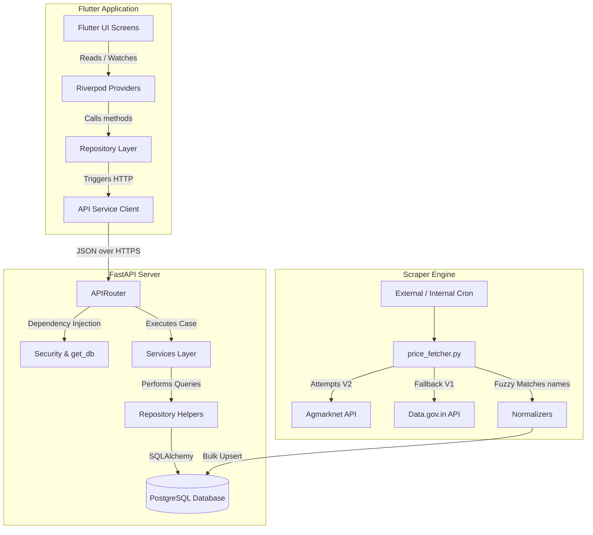

# Mandi Intelligence - Long-Term Architectural Memory

This document serves as the persistent memory and architectural blueprint of the Mandi Intelligence project. It provides all necessary context for future development, ensuring subsequent agent sessions do not need to rediscover the architecture, database schema, state management, or business logic.

---

# 1. Project Overview

- **What this project does**: Mandi Intelligence is an agricultural marketplace analysis platform. It aggregates live agricultural commodity prices from across India, normalizes them, and delivers them via a localized mobile app.
- **Primary purpose**: To empower farmers, traders, and agricultural stakeholders with real-time commodity price data, historical trends, and customized crop tracking.
- **Main user flow**:
  1. **Authentication**: User logs in or signs up via OTP (Email/SMS).
  2. **Onboarding**: New users select their State, District, preferred UI Language, and trackable crops (crop preferences).
  3. **Price Tracking**: The main Home Screen displays current mandi prices filtered by the user's preferred crops.
  4. **Detailed Analysis**: The user taps a card to see historical price movements (7-day trend graph) for a specific commodity-variety-market combo.
  5. **Market Directory**: A dedicated tab lists available markets in a selected state/district, allowing users to drill down by market.
  6. **Profile Management**: Users can edit preferred crops, change languages (English, Malayalam, Hindi), or update location profiles.
- **Current implementation status**:
  - **Backend**: Complete and deployed to Railway. Includes database migrations, price fetching scheduler (disabled/commented out in `main.py` lifespan but running via cron/scripts), fuzzy-matching normalization algorithms, and Resend-based verification mailers.
  - **Frontend**: Full-featured Flutter mobile application with complete translations, riverpod caching, and fl_chart integrations.
- **Major completed features**:
  - OTP verification flow with temporary verification tokens.
  - Forgot Password OTP verification and password reset flow.
  - Dual price ingestion (Agmarknet V2 Private API + Data.gov.in V1 Fallback API).
  - Advanced fuzzy matching normalization for Markets, Commodities, and Varieties.
  - Multi-language localization (English, Hindi, Malayalam) for both App UI and DB-driven entity names.
  - 7-day price history visualization.
- **Known incomplete features / Roadmap**:
  - **Alerts Screen**: A stub tab is present in the UI but has no business logic.
  - **SMS OTP**: Deployed as a terminal print stub for development.
  - **FastAPI Lifespan Tasks**: Commented out inside `main.py`; ingestion is triggered externally or manually.

---

# 2. Tech Stack

### Frontend
- **Framework**: Flutter (Dart ^3.5.0)
- **State Management**: `flutter_riverpod` (^2.5.1)
- **Local Cache / Session**: `flutter_secure_storage` (^9.2.2) (stores JWT token)
- **Charts**: `fl_chart` (^1.2.0)
- **Networking**: `http` (^1.2.1)
- **Localization**: `flutter_localizations` (SDK), `intl` (^0.20.2)
- **Animations**: `shimmer` (^3.0.0)

### Backend
- **Framework**: FastAPI (Python)
- **Server**: Uvicorn
- **ORM / Database Access**: SQLAlchemy
- **Data Fetcher**: `httpx`
- **Config & Validation**: Pydantic / `pydantic-settings`
- **Security & Token**: Passlib (`bcrypt`), `python-jose[cryptography]` (JWT)
- **Email Delivery**: `resend` (SDK)

### Database & Deployment
- **Database**: PostgreSQL (hosted on Railway)
- **Deployment**: Railway (mandi-intelligence-app-production)

---

# 3. Repository Structure

### Backend Layout (`backend/`)
- `backend/app/`
  - `api/`
    - `routes/`: Entity-specific routers:
      - `commodities.py`: Endpoints for fetching commodities (active, all, or today).
      - `districts.py`: Filtering districts by state.
      - `health.py`: Server health checks.
      - `mandi_prices.py`: Querying daily mandi prices with filters.
      - `markets.py`: Loading markets by district.
      - `market_directory.py`: Paginated directory of active markets.
      - `price_history.py`: Returns historical prices (last 7 data points).
      - `states.py`: Returns states having active markets.
    - `auth.py`: Direct authentication endpoints (OTP send, verify, login, register, forgot-password send-otp, verify-otp, reset-password).
    - `crop_preferences.py`: Editing/fetching user crop preferences.
    - `profile.py`: Profile details retrieval and updates.
  - `core/`: Config (`config.py`), DB Engine (`database.py`), Dependencies (`dependencies.py`), Security utilities (`security.py`).
  - `models/`: SQLAlchemy models mapping directly to PostgreSQL tables.
  - `repositories/`: Custom SQL queries, currently houses `mandi_price_repository.py`.
  - `schemas/`: Pydantic validation schemas.
  - `services/`: Core logic:
    - `auth_service.py`: Verification logic, user creation, password reset, JWT issuance.
    - `crop_preference_service.py`: Mapping user crops preferences.
    - `email_service.py`: Resend email wrapper.
    - `otp_service.py`: Generates and verifies transient OTPs.
    - `profile_service.py`: Accesses/modifies user profiles.
    - `verification_token_service.py`: Manages transient tokens proving OTP confirmation.
  - `utils/`: `auth_identifiers.py` to identify/normalize email vs phone numbers.
- `backend/price_fetcher.py`: Manages the scraping/fetching pipeline. Calls `price_fetcher_v1` and `price_fetcher_v2`.
- `backend/price_fetcher_v1.py`: Public Gov API wrapper.
- `backend/price_fetcher_v2.py`: Scrapes official Agmarknet backend JSON API.
- `backend/insert_data.py`: CLI script syncing `Data_mapping.py` to DB tables.
- `backend/generate_mapping.py`: Pulls filters from Agmarknet API and builds `Data_mapping.py`.
- `backend/commodity_normalizer.py`, `market_normalizer.py`, `variety_normalizer.py`: Fuzzy logic mappers matching external inputs to database entity IDs.

### Frontend Layout (`lib/`)
- `lib/core/`
  - `constants/`: API URLs (`api_constants.dart`).
  - `providers/`: Global providers (`locale_provider.dart`, `providers.dart` for storage, authentication api, repo).
  - `theme/`: Global styles (`app_theme.dart`).
- `lib/data/`
  - `models/`: Models for auth response, profile, commodity, district, mandi price, market directory, price history, state.
  - `repositories/`: Repos bridging services and UI (`auth_repository.dart`, `mandi_repository.dart`).
  - `services/`: API communication wrappers (`auth_api_service.dart`, `mandi_api_service.dart`).
- `lib/features/`
  - `auth/`: Login/signup/forgot-password screens, widgets, onboarding screens, and providers (`auth_provider.dart`, `profile_notifier.dart`).
  - `mandi_prices/`: Home Screen, Market Directory Screen, Detailed Charts, and filters (`mandi_prices_provider.dart`, `filter_selection_provider.dart`).
- `lib/l10n/`: Multi-language ARB definitions (en, hi, ml).

---

# 4. High Level Architecture



---

# 5. Backend Architecture

### Endpoints List

| Endpoint | Method | Purpose | Request Schema | Response Schema | Files Involved | DB Tables Touched |
| :--- | :--- | :--- | :--- | :--- | :--- | :--- |
| `/auth/send-otp` | `POST` | Generate and dispatch verification OTP | `SendOTPRequest` | `{"message", "identifier", "registration_method"}` | `auth.py`, `auth_service.py`, `otp_service.py` | `otp_verifications` |
| `/auth/verify-otp` | `POST` | Validate OTP; issue temporary token | `VerifyOTPRequest` | `{"verification_token", "token_type", "expires_in_seconds"}` | `auth.py`, `auth_service.py`, `verification_token_service.py` | `otp_verifications`, `verification_tokens` |
| `/auth/forgot-password/send-otp` | `POST` | Generate and dispatch password reset OTP | `SendOTPRequest` | `{"message", "identifier", "registration_method"}` | `auth.py`, `auth_service.py`, `otp_service.py` | `users`, `otp_verifications` |
| `/auth/forgot-password/verify-otp` | `POST` | Validate password reset OTP; issue reset verification token | `VerifyOTPRequest` | `{"verification_token", "token_type", "expires_in_seconds"}` | `auth.py`, `auth_service.py`, `verification_token_service.py` | `users`, `otp_verifications`, `verification_tokens` |
| `/auth/forgot-password/reset-password` | `POST` | Reset user password using verification token | `ResetPasswordRequest` | `{"message"}` | `auth.py`, `auth_service.py` | `verification_tokens`, `users` |
| `/auth/register` | `POST` | Create verified user profile using verification token | `UserRegister` | `UserResponse` | `auth.py`, `auth_service.py` | `verification_tokens`, `users` |
| `/auth/login` | `POST` | Authenticate credentials; return JWT | `UserLogin` | `{"access_token", "token_type", "user"}` | `auth.py`, `auth_service.py` | `users` |
| `/auth/me` | `GET` | Retrieve session profile info | Bearer Auth Header | `UserResponse` | `auth.py`, `dependencies.py` | `users` |

| `/profile` | `GET` | Get logged-in user profile with state/district | Bearer Auth Header | `UserResponse` | `profile.py`, `profile_service.py` | `users`, `states`, `districts` |
| `/profile` | `PUT` | Edit user profile (name, state, district, language) | `UserProfileUpdate` | `UserResponse` | `profile.py`, `profile_service.py` | `users` |
| `/profile/preferences` | `GET` | List user tracked crop preferences | Bearer Auth Header | `List[CropPreferenceResponse]` | `crop_preferences.py`, `crop_preference_service.py` | `user_crop_preferences`, `commodities` |
| `/profile/preferences` | `PUT` | Bulk update user crop preferences | `CropPreferenceUpdate` | `List[CropPreferenceResponse]` | `crop_preferences.py`, `crop_preference_service.py` | `user_crop_preferences` |
| `/states/` | `GET` | Get states containing active markets | Query Param: `language` | `List[StateSchema]` | `states.py` | `states`, `state_translations` |
| `/districts/` | `GET` | Fetch districts inside a state | Query Params: `state`, `state_id`, `language` | `List[DistrictSchema]` | `districts.py` | `districts`, `district_translations` |
| `/markets/` | `GET` | List markets inside a district having prices today | Query Params: `district_id`, `language` | `List[MarketSchema]` | `markets.py` | `markets`, `market_translations`, `mandi_prices` |
| `/markets/{id}/commodities` | `GET` | Retrieve active commodity names for a market today | Path Param: `market_id` | `{"market_id", "commodity_count", "commodities"}` | `markets.py` | `commodities`, `mandi_prices` |
| `/commodities/` | `GET` | Fetch commodities containing price reports today | None | `List[CommoditySchema]` | `commodities.py` | `commodities`, `mandi_prices` |
| `/commodities/active` | `GET` | List seeded trackable active commodities | None | `List[CommoditySchema]` | `commodities.py` | `commodities`, `active_commodity` |
| `/commodities/all` | `GET` | List all commodities in mapping table | None | `List[CommoditySchema]` | `commodities.py` | `commodities` |
| `/mandi-prices/` | `GET` | Search/paginate raw price records with localization | Query Params: `state`, `district`, `market`, `commodity`, `variety`, `language`, `page`, `page_size` | Paginated JSON | `mandi_prices.py` | `mandi_prices`, `commodities`, `states`, `districts`, `markets`, `varieties`, `grade`, `*_translations` |
| `/price-history/` | `GET` | Returns 7 latest modal price records | Query Params: `commodity`, `market`, `variety` | `List[PriceHistoryResponse]` | `price_history.py`, `mandi_price_service.py` | `mandi_prices` |
| `/market-directory/` | `GET` | Search/paginate directory of markets reporting prices today | Query Params: `state_id`, `district_id`, `commodity_id`, `search`, `language`, `page`, `page_size` | Paginated JSON | `market_directory.py` | `markets`, `districts`, `states`, `mandi_prices`, `*_translations` |

---

# 6. Database Schema

All primary schema definitions exist in `backend/app/models/`.

```
 +--------------------+       +--------------------+       +--------------------+
 |       states       |------<|    districts       |------<|      markets       |
 +--------------------+       +--------------------+       +--------------------+
           |                            |                            |
 +--------------------+       +--------------------+       +--------------------+
 | state_translations |       |district_translat's |       |market_translations |
 +--------------------+       +--------------------+       +--------------------+
                                                                     |
 +--------------------+       +--------------------+                 |
 | commodities_group  |       |    mandi_prices    |>----------------+
 +--------------------+       +--------------------+
           |                            |
 +--------------------+                 |
 |    commodities     |-----------------+
 +--------------------+                 |
     |            |                     |
 +-------+    +-------+                 |
 |variety|    | grade |-----------------+
 +-------+    +-------+
```

### Reference Tables

1. **`states`**
   - Columns: `id` (INTEGER, PK), `name` (VARCHAR, Nullable=False)
   - Relationships: `districts` (Has-Many)
2. **`state_translations`**
   - Columns: `id` (INTEGER, PK), `state_id` (INTEGER, FK -> `states.id`), `language_code` (VARCHAR(2)), `translated_name` (VARCHAR)
   - Constraint: Unique(`state_id`, `language_code`)
3. **`districts`**
   - Columns: `id` (INTEGER, PK), `state_id` (INTEGER, FK -> `states.id`), `name` (VARCHAR, Nullable=False)
   - Relationships: `markets` (Has-Many)
4. **`district_translations`**
   - Columns: `id` (INTEGER, PK), `district_id` (INTEGER, FK -> `districts.id`), `language_code` (VARCHAR(2)), `translated_name` (VARCHAR)
   - Constraint: Unique(`district_id`, `language_code`)
5. **`markets`**
   - Columns: `id` (INTEGER, PK), `district_id` (INTEGER, FK -> `districts.id`), `name` (VARCHAR, Nullable=False)
   - Relationships: `mandi_prices` (Has-Many)
6. **`market_translations`**
   - Columns: `id` (INTEGER, PK), `market_id` (INTEGER, FK -> `markets.id`), `language_code` (VARCHAR(2)), `translated_name` (VARCHAR)
   - Constraint: Unique(`market_id`, `language_code`)
7. **`commodities_group`**
   - Columns: `id` (INTEGER, PK), `name` (VARCHAR, Nullable=False)
   - Relationships: `commodities` (Has-Many)
8. **`commodities`**
   - Columns: `id` (INTEGER, PK), `name` (VARCHAR, Nullable=False), `commodity_group_id` (INTEGER, FK -> `commodities_group.id`)
   - Relationships: `varieties` (Has-Many), `grades` (Has-Many), `translations` (Has-Many), `mandi_prices` (Has-Many)
9. **`commodity_translations`**
   - Columns: `id` (INTEGER, PK), `commodity_id` (INTEGER, FK -> `commodities.id`), `language_code` (VARCHAR(2)), `translated_name` (VARCHAR)
   - Constraint: Unique(`commodity_id`, `language_code`)
10. **`varieties`**
    - Columns: `id` (INTEGER, PK), `commodity_id` (INTEGER, FK -> `commodities.id`), `name` (VARCHAR, Nullable=False)
11. **`grade`** (Table name: `grade`)
    - Columns: `id` (INTEGER, PK), `grade_name` (VARCHAR, Nullable=False), `commodity_id` (INTEGER, FK -> `commodities.id`)
12. **`active_commodity`**
    - Columns: `id` (INTEGER, PK), `commodity_id` (INTEGER, FK -> `commodities.id`, unique=True, cascade ondelete)

### Core Transactional Data

13. **`mandi_prices`**
    - Columns:
      - `id` (INTEGER, PK)
      - `commodity_id` (INTEGER, FK -> `commodities.id`, Nullable=False)
      - `variety_id` (INTEGER, FK -> `varieties.id`, Nullable=False)
      - `grade_id` (INTEGER, FK -> `grade.id`, Nullable=False)
      - `market_id` (INTEGER, FK -> `markets.id`, Nullable=False)
      - `modal_price` (NUMERIC, Nullable=False)
      - `min_price` (NUMERIC, Nullable=False)
      - `max_price` (NUMERIC, Nullable=False)
      - `arrival_date` (DATE, Nullable=False)
      - `created_at` (DATETIME, default=Asia/Kolkata timezone)
    - Constraint: Unique(`commodity_id`, `variety_id`, `grade_id`, `market_id`, `arrival_date`) -> Named `mandi_prices_unique`

### User Profiles & Session

14. **`users`**
    - Columns:
      - `id` (UUID, PK, Default=uuid4)
      - `name` (VARCHAR(100), Nullable=False)
      - `email` (VARCHAR(255), Unique, Nullable=True)
      - `phone_number` (VARCHAR(20), Unique, Nullable=True)
      - `password_hash` (VARCHAR, Nullable=False)
      - `state_id` (INTEGER, FK -> `states.id`, Nullable=True)
      - `district_id` (INTEGER, FK -> `districts.id`, Nullable=True)
      - `preferred_language` (VARCHAR(20), Default='en')
      - `registration_method` (VARCHAR(20), Nullable=False)
      - `is_verified` (BOOLEAN, Default=False)
      - `created_at` (TIMESTAMP, default=now())
      - `updated_at` (TIMESTAMP, default=now(), onupdate=now())
    - Constraints:
      - Exactly one identifier must be set: `(email IS NOT NULL AND phone_number IS NULL) OR (email IS NULL AND phone_number IS NOT NULL)`
      - Registration method constraint: `registration_method IN ('email', 'phone')`
15. **`user_crop_preferences`**
    - Columns: `user_id` (UUID, PK, FK -> `users.id`), `commodity_id` (INTEGER, PK, FK -> `commodities.id`)
16. **`refresh_tokens`**
    - Columns: `id` (UUID, PK), `user_id` (UUID, FK -> `users.id`), `token` (TEXT), `expires_at` (DATETIME)
17. **`otp_verifications`**
    - Columns: `id` (UUID, PK), `identifier` (VARCHAR(255)), `otp_hash` (VARCHAR), `purpose` (VARCHAR(50)), `expires_at` (TIMESTAMP WITH TIMEZONE), `used` (BOOLEAN), `created_at` (TIMESTAMP WITH TIMEZONE)
18. **`verification_tokens`**
    - Columns: `id` (UUID, PK), `identifier` (VARCHAR(255)), `token_hash` (VARCHAR), `purpose` (VARCHAR(50)), `expires_at` (TIMESTAMP WITH TIMEZONE), `used` (BOOLEAN), `created_at` (TIMESTAMP WITH TIMEZONE)

---

# 7. Frontend Architecture

### Navigation Flow

```
                      +-------------------+
                      |    LoginScreen    |
                      +-------------------+
                                |  (Successful Authentication)
                                v
                      +-------------------+
                      |   AuthWrapper     |
                      +-------------------+
                                |
             +------------------+------------------+
             | (Completed profile == false)        | (Completed profile == true)
             v                                     v
   +-------------------+                 +-------------------+
   | OnboardingScreen  |                 |    MainScreen     |
   +-------------------+                 +-------------------+
             | (Submits onboarding data)           | (Bottom Navigation Bar)
             +------------------+                  +---------+---------+---------+
                                v                            |         |         |
                      +-------------------+                  |         |         |
                      |    MainScreen     |<-----------------+         |         |
                      +-------------------+                            |         |
                                |                                      |         |
            +-------------------+-------------------+                  |         |
            | Tab 0: Home                           | Tab 1: Markets   |         | Tab 3: Profile
            v                                       v                  v         v
  +--------------------+                 +--------------------+   [Alerts]   +---------------+
  |    HomeScreen      |                 |   MarketsScreen    |   (Stub)     | ProfileScreen |
  +--------------------+                 +--------------------+              +---------------+
            | (Quick Filters Applied)               | (Select Market)                | (Edit Profile)
            v                                       v                                v
  +--------------------+                 +--------------------+              +---------------+
  |FilterResultsScreen |                 |MktDirectoryDetailSc|              |OnboardingScr  |
  +--------------------+                 +--------------------+              | (isEdit=true) |
            | (Tap Price Card)                      | (Select Commodity)             +---------------+
            +-------------------+-------------------+
                                v
                      +-------------------+
                      |MarketDetailScreen |
                      +-------------------+
```

### Screens & Widget Inventory

1. **`LoginScreen`** (`login_screen.dart`): Collects credentials (email/phone and password), directs to sign up, forgot password, or logs in.
2. **`ForgotPasswordScreen`** (`forgot_password_screen.dart`): Multi-stage password reset flow.
   - Phase 1: Inputs registered email/phone. Calls `/auth/forgot-password/send-otp`.
   - Phase 2: User inputs OTP. Calls `/auth/forgot-password/verify-otp` and receives a reset verification token.
   - Phase 3: User inputs new password and confirmation. Calls `/auth/forgot-password/reset-password`, pops back to `LoginScreen` upon success.
3. **`SignupScreen`** (`signup_screen.dart`): Multiphasic registration flow.
   - Phase 1: Inputs email/phone. Calls `/auth/send-otp`.
   - Phase 2: User inputs OTP. Calls `/auth/verify-otp` and receives a verification token.
   - Phase 3: Input Name and Password. Sends token and user details to `/auth/register` to finalize.
4. **`OnboardingScreen`** (`onboarding_screen.dart`): Profile completion configuration. Contains selections for State, District, Preferred Language, and crop tags (multiselection grid). Also functions as the profile editing form when `isEditMode = true`.
5. **`HomeScreen`** (`home_screen.dart`): Dashboard. Renders:
   - Profile summary (Greeting + localized tracked commodity tags).
   - Localized dropdowns for States, Districts, Markets, and Commodities.
   - Paginated ListView of `PriceCard` elements showing modal, minimum, and maximum prices for the current day.
6. **`FilterResultsScreen`** (`filter_results_screen.dart`): Renders results of user-customized dropdown values.
7. **`MarketsScreen`** (`markets_screen.dart`): Displays a searchable index of mandis. Users must select a State first to initialize the list.
8. **`MarketDirectoryDetailScreen`** (`market_directory_detail_screen.dart`): Displays specific market metadata. Fetches the list of active commodities via `/markets/{market_id}/commodities`. Tapping a commodity launches `FilterResultsScreen` pre-filtered for that market and crop.
9. **`MarketDetailScreen`** (`market_detail_screen.dart`): Detailed commodity views. Integrates `fl_chart` to render a 7-day price timeline.
10. **`ProfileScreen`** (`profile_screen.dart`): Shows user details (avatar, name, email/phone, region, language) and tracked crops. Provides action buttons to Edit Profile (pushes `OnboardingScreen(isEditMode: true)`) and Logout.


---

# 8. State Management

The application is built using **Riverpod**.

### Key Riverpod Providers

- **`authProvider`** (`auth_provider.dart`)
  - **Type**: `NotifierProvider<AuthNotifier, AuthState>`
  - **Responsibility**: Manages global login states, transient signup details (signupIdentifier, verificationToken, otpVerified), errors, loading flags, and triggers redirection.
- **`localeProvider`** (`locale_provider.dart`)
  - **Type**: `StateNotifierProvider<LocaleNotifier, Locale>`
  - **Responsibility**: Manages current locale context (`en`, `hi`, `ml`).
- **`profileNotifierProvider`** (`profile_notifier.dart`)
  - **Type**: `AutoDisposeAsyncNotifierProvider<ProfileNotifier, UserProfile?>`
  - **Responsibility**: Fetches, caches, and invalidates profile records from `/profile`.
- **`preferredCropsNotifierProvider`** (`profile_notifier.dart`)
  - **Type**: `AutoDisposeAsyncNotifierProvider<PreferredCropsNotifier, List<Map<String, dynamic>>>`
  - **Responsibility**: Manages user preferred commodities list from `/profile/preferences`.
- **`editProfileDataProvider`** (`edit_profile_data_provider.dart`)
  - **Type**: `FutureProvider.autoDispose<EditProfileData>`
  - **Responsibility**: Combines profile state, preferred crops, all commodities list, states, and conditional districts to initialize onboarding fields.
- **`mandiPricesProvider`** (`mandi_prices_provider.dart`)
  - **Type**: `StateNotifierProvider.family<MandiPricesNotifier, AsyncValue<MandiPricesState>, Filter>`
  - **Responsibility**: Handles paginated daily mandi price retrieval. Listens to `localeProvider` and triggers refetch on locale language changes to query correct translations.
- **`marketDirectoryProvider`** (`mandi_prices_provider.dart`)
  - **Type**: `StateNotifierProvider.family<MarketDirectoryNotifier, AsyncValue<MarketDirectoryState>, ...>`
  - **Responsibility**: Manages paginated market directory fetching.
- **`statesProvider`** (`mandi_prices_provider.dart`)
  - **Type**: `FutureProvider<List<StateModel>>`
  - **Responsibility**: Fetches all available states. Reactive to `localeProvider`.
- **`districtsProvider`** (`mandi_prices_provider.dart`)
  - **Type**: `FutureProvider.family<List<District>, int?>`
  - **Responsibility**: Fetches districts inside a state ID. Reactive to `localeProvider`.
- **`marketsProvider`** (`mandi_prices_provider.dart`)
  - **Type**: `FutureProvider.family<List<String>, int?>`
  - **Responsibility**: Fetches market names inside a district ID. Reactive to `localeProvider`.

---

# 9. Models & Schemas

### Frontend Models (`lib/data/models/`)
- **`UserProfile`** (`user_profile.dart`): User details model. Includes helper getter `hasCompletedProfile` (checks `stateId != null && districtId != null`).
- **`MandiPrice`** (`mandi_price.dart`): Price record details. Includes localized display support: `getDisplayCommodity()` returns `translatedName` if preferred language matches, falling back to English `commodity`.
- **`StateModel`** (`state_model.dart`): State details with localized `getDisplayName` support.
- **`District`** (`district_model.dart`): District details with localized `getDisplayName` support.
- **`MarketDirectory`** (`market_directory_model.dart`): Simplified representation for market indices.
- **`PriceHistory`** (`price_history.dart`): Minimal date and modal price combo for visual charting.

### Backend Schemas (`backend/app/schemas/`)
- **`UserResponse`** (`user.py`): Pydantic model for users. Translates database objects to JSON, mapping properties `state_name` and `district_name`.
- **`SendOTPRequest` / `VerifyOTPRequest` / `UserRegister` / `UserLogin`** (`user.py`): Validation containers mapping input keys for authentication pipelines.
- **`StateSchema` / `DistrictSchema` / `MarketSchema`** (`location.py`): Localized location containers carrying translation properties.
- **`MandiPriceSchema`** (`mandi_price.py`): Maps attributes to model values during DB transactions.

---

# 10. Services & Normalization Logic

### Core Services

1. **`AuthService`** (`auth_service.py`)
   - Normalizes input registration methods (email/phone detection).
   - Coordinates OTP dispatch, verification token creation, and final user persistence.
2. **`OTPService`** (`otp_service.py`)
   - Generates cryptographically secure 6-digit OTP codes.
   - bcrypts OTP codes for storage to protect against DB leaks.
   - Standard 5-minute expiry logic.
   - Deletes unused old OTP records for the identifier during new attempts.
3. **`EmailService`** (`email_service.py`)
   - Resend SDK integration. Sends localized transactional HTML emails containing the OTP.
4. **`VerificationTokenService`** (`verification_token_service.py`)
   - Generates URL-safe verification tokens (32 characters).
   - BCrypts verification tokens before DB storage.
   - 10-minute expiry validation logic. Must be provided to register.

### Normalization Logic (`backend/`)
During price updates, raw market, commodity, and variety strings inside inputs vary dramatically in spelling, spacing, and suffixes. The pipeline uses fuzzy normalization:

- **`commodity_normalizer.py`**: Compares string against static commodities lists. Resolves common naming variations to database IDs.
- **`market_normalizer.py`**: Normalizes market names using state and district names as search contexts, using a fuzzy matching threshold score of `0.65`.
- **`variety_normalizer.py`**: Normalizes crop varieties (e.g. "Hybrid", "Local") using `commodity_id` as search context (fuzzy matching threshold `0.65`).

---

# 11. Business Logic

### Registration & Onboarding Lifecycle
```
[User identifier (Email/Phone)]
           │
           ▼
   /auth/send-otp
           │
           ▼ (Sends email via Resend OR prints SMS to console)
     [Receive OTP]
           │
           ▼
  /auth/verify-otp
           │
           ▼ (Validates OTP, deletes old tokens, saves/returns verification_token)
 [Get verification_token]
           │
           ▼
    /auth/register (Provide Name, Password, Language, Location, token)
           │
           ▼ (Validates token is active, registers user, invalidates token)
     [Account Created]
```

### Price Ingestion Engine (`backend/price_fetcher.py`)
The pipeline runs daily to update market prices:
1. Loops through all commodities present in the `active_commodity` database table.
2. Resolves commodity names to Agmarknet Group and Commodity IDs using `getId.py`.
3. Calls Version 2 API (`api.agmarknet.gov.in/v1/daily-price-arrival/report`) using a JSON POST request.
4. If V2 fails (timeout, 5xx server issues, or 402 access limits), it falls back to Version 1 API (`api.data.gov.in/resource/9ef84268-d588-465a-a308-a864a43d0070`) using an API Key.
5. Ingested records are filtered through `validate_records()`.
6. Normalizers fuzzy match text names for markets, commodities, and varieties to corresponding database IDs.
7. Commits bulk updates to the database using PostgreSQL's `on_conflict_do_update` (on constraint `mandi_prices_unique`) to update `min_price`, `max_price`, and `modal_price` if a record already exists for that commodity, variety, grade, market, and date.

---

# 12. External APIs

1. **Agmarknet V2 Daily API**
   - **URL**: `https://api.agmarknet.gov.in/v1/daily-price-arrival/report`
   - **Purpose**: Main data source. Provides daily mandi arrivals and prices.
   - **Auth**: None (Uses payload parameter mappings).
2. **Gov V1 Public API**
   - **URL**: `https://api.data.gov.in/resource/9ef84268-d588-465a-a308-a864a43d0070`
   - **Purpose**: Fallback data provider.
   - **Auth**: Query parameter `api-key`.
3. **Resend SMTP API**
   - **Purpose**: OTP email dispatcher.
   - **Auth**: Bearer API key (`RESEND_API_KEY`).

---

# 13. End-to-End Data Flow

### Example: User opens Home Screen
1. **Flutter UI**: `HomeScreen` builds and watches `mandiPricesProvider(filter)`.
2. **Provider**: `mandiPricesProvider` triggers `MandiPricesNotifier.loadInitialPage()`.
3. **Repository**: Calls `MandiRepository.getMandiPrices(filter, page, language)`.
4. **API Service**: Performs GET to `/mandi-prices` with state, district, market, commodity, and language parameters.
5. **FastAPI Route**: `get_mandi_prices()` runs inside `mandi_prices.py`.
6. **Database**: Joins tables `mandi_prices`, `markets`, `districts`, `states`, `commodities`, `varieties`, `grade`, and translations. Filters by `arrival_date == date.today()`.
7. **Response**: Backend builds the paginated JSON response, translating state/district/market/commodity names to the requested language.
8. **UI rendering**: Mandi response is parsed to `PaginatedMandiResponse` models. The UI updates from `Loading` to `Success` state, rendering `PriceCard` lists.

---

# 14. Important Constants & Configuration

### Environment Variables (`backend/.env`)
- `DATABASE_URL`: Hosted PostgreSQL connection URL.
- `API_KEY`: Gov data API key.
- `SECRET_KEY`: Used to sign JWT tokens.
- `RESEND_API_KEY`: API key for email delivery.
- `SMTP_HOST` / `SMTP_PORT` / `SMTP_EMAIL` / `SMTP_PASSWORD`: Standard SMTP fallback configurations.

### API Paths (`lib/core/constants/api_constants.dart`)
- `baseUrl`: `https://mandi-intelligence-app-production.up.railway.app`
- `mandiPricesEndpoint`: `/v1/mandi-prices` (Note: Backend routes are mounted at root, so the path is `/mandi-prices`).

---

# 15. File Dependency Graph

```
                                 [main.py]
                                     │
         ┌───────────────────────────┼───────────────────────────┐
         ▼                           ▼                           ▼
  [api/routes/*.py]             [api/auth.py]             [api/profile.py]
         │                           │                           │
         │                           ▼                           ▼
         │                   [services/auth.py]        [services/profile.py]
         │                           │                           │
         └───────────────────────────┼───────────────────────────┘
                                     ▼
                            [core/dependencies.py]
                                     │
                                     ▼
                            [models/__init__.py]
                                     │
                        ┌────────────┴────────────┐
                        ▼                         ▼
                 [models/user.py]        [models/mandi_price.py]
                        │                         │
                        ▼                         ▼
                [core/database.py]        [core/security.py]
```

- **Critical Ingestion Pipeline Path**: `price_fetcher.py` -> calls `price_fetcher_v1.py` & `price_fetcher_v2.py` -> calls `getId.py` -> reads `Data_mapping.py`.

---

# 16. Common Development Tasks

### 1. Adding a New API Endpoint
- **Backend**:
  1. Define response schema inside `backend/app/schemas/`.
  2. Implement endpoint logic in relevant file in `backend/app/api/routes/` or create a new route.
  3. Register new routers in `backend/app/main.py` using `app.include_router()`.
- **Frontend**:
  1. Create model classes inside `lib/data/models/`.
  2. Define mapping methods inside `lib/data/services/mandi_api_service.dart`.
  3. Expose method in `lib/data/repositories/mandi_repository.dart`.
  4. Create or update Riverpod providers inside `lib/features/.../providers/`.

### 2. Adding a New Screen
- **Frontend**:
  1. Define UI widget inside `lib/features/.../screens/`.
  2. Hook up page routing inside `lib/main_screen.dart` or via navigation triggers.
  3. Watch relevant provider states inside screens.

### 3. Adding a Database Column
- **Backend**:
  1. Add column property in `backend/app/models/...`.
  2. Update Pydantic schemas in `backend/app/schemas/...` to expose it.
  3. Run database migrations to update table layout.

---

# 17. Technical Debt & Gotchas

1. **Lifespan Task Execution**: Commented out inside `main.py` due to execution context blocking during server startup. Pipeline scraping runs are triggered manually or via scheduler cron scripts.
2. **SMS Dispatcher Dev Stub**: No real SMS gateway is integrated. Phone verification prints the OTP to console.
3. **Equatable Missing in Filter**: `Filter` uses custom operator overrides instead of package `equatable`.
4. **Database Table Naming**:
   - `grade` is named singular in the DB.
   - `active_commodity` is named singular in the DB.
   - All other entity tables (`states`, `districts`, `markets`, `commodities`, `varieties`, `mandi_prices`, `users`, `refresh_tokens`, `verification_tokens`, `otp_verifications`, `user_crop_preferences`) are named plural.
5. **No Migration Engine**: Tables are generated via `Base.metadata.create_all(bind=engine)` inside `create_tables.py`. Modifying columns requires manually altering database tables or running manual ALTER SQL statements.

---

# 18. Important Design Decisions

1. **Dual Scraper Fetching Sequence**: Agmarknet V2 Daily API is faster and contains accurate commodity data. Gov V1 is rate-limited and has a lag of up to 48 hours. The pipeline is designed to attempt V2 first, falling back to V1 on failure, maximizing ingestion reliability.
2. **Transient Verification Tokens**: Rather than keeping registration endpoints open, verifying an OTP creates a hashed transient token. Users must present this token to call `/auth/register`. This ensures registration data originates from verified email/phone numbers.
3. **Reference ID Dictionary Cache**: To avoid database overhead when normalizing thousands of incoming mandi prices, `price_fetcher.py` loads `states`, `districts`, `markets`, `commodities`, `varieties`, and `grades` into memory maps during execution start. Fuzzy search normalization runs in $O(1)$ memory time rather than executing individual SELECT queries.

---

# 19. Things Future Agents Must Know

- **Translations Pattern**: Entity translation columns are housed in separate tables (`*_translations`). Translating outputs requires joining the translation table for the target `language_code` and falling back to the standard English column if missing.
- **Ingestion Execution context**: Running `price_fetcher.py` directly requires resolving module paths. Always run python tasks from the root workspace folder, setting python paths appropriately.
- **Registration Methods constraint**: The `users` table constraint `ck_users_exactly_one_identifier` prevents a user from having both email and phone number set simultaneously. Ensure signup payloads match the target authentication method.

---

# 20. Architecture Summary for Future Agents

```
                        [Client Interface (Flutter)]
                                     │
                       (JSON over REST API endpoints)
                                     │
                                     ▼
                         [Routing layer (FastAPI)]
                                     │
                  (Dependency injection & auth validation)
                                     │
                                     ▼
                          [Services (FastAPI)]
                                     │
                 (Database queries & business transactions)
                                     │
                                     ▼
                      [Storage Layer (PostgreSQL)]
```

### Quick Ingestion Pipeline Reference
`Agmarknet (Filters API)` -> `generate_mapping.py` -> `Data_mapping.py` -> `insert_data.py` -> `PostgreSQL tables`

`Agmarknet/Gov (Prices API)` -> `price_fetcher.py` -> `Fuzzy normalizers` -> `PostgreSQL (mandi_prices)`

---

# 21. Forecasts Module (Implemented July 2026)

### Feature Overview
- **Forecasts Section**: Replaces the pre-existing Alerts screen stub in the bottom navigation. It displays predicted price movements and sales recommendations for the user's preferred crops.
- **Preferred Crops Scope**: Filters predictions using preferred crops loaded from `preferredCropsNotifierProvider` based on the user's region profile. Capped at a maximum of 5 cards.
- **Production Data Mode**: Connected directly to the live backend predictions API. The mock warning banner has been removed.

### New Models (`lib/data/models/forecast_model.dart`)
- **`CommodityForecast`**: Maps forecast properties: `commodity` (String), `currentPrice` (double), `forecast` (List<ForecastDay>), `trend` (String: RISING/FALLING/STABLE), `bestSellDate` (String), `expectedPeakPrice` (double), `recommendation` (String: WAIT/SELL TODAY/HOLD).
- **`ForecastDay`**: Minimal object containing `date` (String) and `price` (double).

### New Providers (`lib/features/forecasts/providers/forecast_provider.dart`)
- **`forecastRepositoryProvider`**: Injects `ForecastRepository` with a reference to the `AuthRepository`.
- **`forecastsNotifierProvider`**: Watches user preferences (`preferredCropsNotifierProvider`) to automatically reload predictions. Exposes `.refresh()` to trigger pull-to-refresh actions.

### New Repository Methods (`lib/data/repositories/forecast_repository.dart`)
- **`ForecastRepository.getForecastsForPreferredCrops()`**:
  - Dynamically fetches user's preferred crops, and generates mock forecast data for each crop.
  - Matches the exact API response contract for `Tomato` (RISING trend, WAIT recommendation, 2450.0 current price, 2610.0 expected peak price).
  - Integrates test controls (`simulateForecastLoading`, `simulateForecastError`, `simulateForecastEmpty`) to verify different UI states.

### New Widgets & Screens (`lib/features/forecasts/`)
- **`ForecastsScreen`** (`screens/forecasts_screen.dart`): Displays the mock data warning banner, handles AsyncValue states (shimmer loader, retry error block, empty preference prompt, and forecast lists).
- **`ForecastCard`** (`widgets/forecast_card.dart`): Renders predictions with Material 3 styling. Displays recommendation tags (color-coded), commodity name, price summary block, best selling day, and a disabled "View Forecast" action button.

### Future Backend Endpoint Expectation
The frontend matches the proposed JSON response contract:
`GET /profile/forecasts` (or `/forecasts`) -> `List[CommodityForecast]`
The repository method `getForecastsForPreferredCrops` can be replaced with an HTTP call to the real API endpoint without requiring changes to screens, providers, widgets, models, or state management.

---

# 22. Forecast Detail Screen (Implemented July 2026)

### Feature Overview
- **Forecast Detail Screen**: Allows the user to tap on any forecast card to view a comprehensive hero summary, a 7-day predicted price trajectory line chart, and a daily detailed list highlighting the best day to sell.
- **Navigation Flow**: Pushes `ForecastDetailScreen` onto the navigation stack when tapping the `ForecastCard` from the `ForecastsScreen`. The navigation passes the existing `CommodityForecast` object so no additional fetches are made.

### New Widgets & Screens (`lib/features/forecasts/`)
- **`ForecastDetailScreen`** (`screens/forecast_detail_screen.dart`):
  - **Hero Summary Card**: Features a modern, elevated card detailing the commodity name, current price, recommendation badge, trend with inline icons, best selling day, and expected peak price.
  - **7-Day Forecast Chart**: Embeds a clean, curvy `LineChart` using `fl_chart` with horizontal grid lines, touch tooltips showing price/date, custom green/white point markers, and dates rotated 30 degrees on the X axis to prevent overlapping.
  - **Daily Forecast List**: Displays a vertical card list of all predicted prices. Evaluates each row and applies a distinct green border, green light background, a star icon, and a `"BEST DAY"` badge if it matches the `bestSellDate`.
  - **Future-Proof Structure**: The screen is structurally designed to handle loading and error states via local flags which can easily be bound to an async API call in the future.
- **Tappable `ForecastCard`** (`widgets/forecast_card.dart`):
  - Updated to accept a `VoidCallback? onTap` parameter.
  - Wrapped the container interior in an `InkWell` to enable smooth ripple click interaction across the entire card.

---

# 23. Forecasts Refactoring & Database Alignment (Refactored July 2026)

### Architectural Changes
- **Commodity ID Based Identification**:
  - `CommodityForecast` data model updated to rely on `commodity_id` internally as the primary identifier.
  - The model holds both `commodity_id` and `commodity_name` fields.
- **Dynamic Translation Lookups**:
  - Instead of hardcoding crop names, the repository `getForecastsForPreferredCrops` takes a `language` parameter. It maps original English names to translated crop names based on the active language code (`en`, `hi`, `ml`).
  - The UI consumes `commodity_name` directly, allowing the backend endpoint to return `commodity_id` only, while the repository handles details resolution.
- **Prediction Date and Time**:
  - Added separate `prediction_date` (String, e.g., `"2026-07-13"`) and `prediction_time` (String, e.g., `"11:00 AM"`) to record when predictions are generated.
- **Latest Prediction Batch Filtering**:
  - Multiple prediction batches may exist for the same day.
  - The repository dynamically filters the simulated dataset to only return predictions from today (`prediction_date == today`) belonging to the latest batch (`latest prediction_time` of today, i.e., `"11:00 AM"`).
  - The UI stays clean of filtering logic, satisfying the future backend expectations.

### Localization & Multi-language Support
- Replaced all hardcoded text strings in `ForecastsScreen` and `ForecastDetailScreen` with keys from `app_en.arb`, `app_hi.arb`, and `app_ml.arb`.
- Localized keys include recommendation badges (`sellTodayLabel`, `waitLabel`, `holdLabel`), trends (`risingLabel`, `fallingLabel`, `stableLabel`), metadata headers, buttons, and empty/error state messages.

### Affected Files
- **Models**: [forecast_model.dart](file:///c:/Users/HP/Desktop/Projects/2026%20summer%20projects/mandi-intelligence-app/lib/data/models/forecast_model.dart)
- **Repository**: [forecast_repository.dart](file:///c:/Users/HP/Desktop/Projects/2026%20summer%20projects/mandi-intelligence-app/lib/data/repositories/forecast_repository.dart)
- **Provider**: [forecast_provider.dart](file:///c:/Users/HP/Desktop/Projects/2026%20summer%20projects/mandi-intelligence-app/lib/features/forecasts/providers/forecast_provider.dart)
- **Widgets & Screens**:
  - [forecast_card.dart](file:///c:/Users/HP/Desktop/Projects/2026%20summer%20projects/mandi-intelligence-app/lib/features/forecasts/widgets/forecast_card.dart)
  - [forecasts_screen.dart](file:///c:/Users/HP/Desktop/Projects/2026%20summer%20projects/mandi-intelligence-app/lib/features/forecasts/screens/forecasts_screen.dart)
  - [forecast_detail_screen.dart](file:///c:/Users/HP/Desktop/Projects/2026%20summer%20projects/mandi-intelligence-app/lib/features/forecasts/screens/forecast_detail_screen.dart)

---

# 24. Backend Predictions & Localization Endpoint (Updated July 2026)

### Feature Overview
- **Predictions Endpoint**: The `GET /predictions` API endpoint in the FastAPI backend accepts the `language` query parameter (e.g. `?language=en`, `?language=hi`, `?language=ml`).
- **Pagination Support**: Supports server-side pagination with query parameters `page` (default = 1) and `page_size` (default = 15). The pagination is enforced deterministically at the database level using `LIMIT` and `OFFSET` on the distinct combinations of `(commodity_id, market_id, variety_id, grade_id)`.
- **Sorting Order**: Predictions are sorted in ascending order before pagination using the following priority order:
  1. Commodity Name (Ascending)
  2. State Name (Ascending)
  3. District Name (Ascending)
  4. Market Name (Ascending)
  5. Variety Name (Ascending)
  6. Grade Name (Ascending)
- **Authorization & Context**: Authenticates requests using `get_current_user` to read the user's crop preferences. It dynamically resolves the latest prediction details for the preferred crop ids.
- **Database Architecture Integration**:
  - `prediction_batches` (Table): Stores metadata about each model run batch (`prediction_date`, `prediction_time`, `model_version`, `created_at`).
  - `commodity_predictions` (Table): Stores predicted prices for specific Market-Commodity-Variety-Grade combinations (`id`, `batch_id`, `market_id`, `commodity_id`, `variety_id`, `grade_id`, `prediction_day`, `predicted_price`, `created_at`).

### Core Architecture Components

#### SQLAlchemy Models (`app/models/`)
- **`PredictionBatch`** (`prediction_batch.py`): Maps `prediction_batches` table, with a relationship to `CommodityPrediction`.
- **`CommodityPrediction`** (`commodity_prediction.py`): Maps `commodity_predictions` table, with foreign keys and relationships to `PredictionBatch`, `Commodity`, `Market`, `Variety`, and `Grade`.

#### Pydantic Schemas (`app/schemas/prediction.py`)
- **`ForecastDay`**: Minimal object holding `date` and `price`.
- **`ForecastResponse`**: Main response payload schema containing BOTH ids and localized display names.
- **`PaginatedForecastResponse`**: Wraps the paginated response with the following structure:
  ```json
  {
      "page": 1,
      "page_size": 15,
      "total": 48,
      "has_next": true,
      "predictions": [
          {
              "commodity_id": 19,
              "commodity_name": "Banana",
              "market_id": 85,
              "market_name": "Ladwa APMC",
              "district_id": 175,
              "district_name": "Kurukshetra",
              "state_id": 12,
              "state_name": "Haryana",
              "variety_id": 1537,
              "variety_name": "Medium",
              "grade_id": 3448,
              "grade_name": "Medium",
              "prediction_date": "2026-07-15",
              "prediction_time": "03:00 PM",
              "current_price": 3500.0,
              "forecast": [
                  { "date": "2026-07-15", "price": 2000.0 }
              ],
              "trend": "Rising",
              "recommendation": "Wait",
              "best_sell_date": "2026-07-19",
              "expected_peak_price": 2400.0
          }
      ]
  }
  ```

#### Repository Layer (`app/repositories/prediction_repository.py`)
- **`get_latest_batch()`**: Queries today's latest batch (`prediction_date = CURRENT_DATE` ordered by time descending).
- **`get_predictions_with_details_paginated()`**: Eagerly loads all chronological prediction records for preferred crops in the batch. Joins with `Commodity`, `Market` (and nested `District`, `State`), `Variety`, and `Grade` tables (with respective translation tables), applies ascending ordering priorities, and fetches paginated results with database-level distinct combos pagination.
- **`get_latest_mandi_prices_for_combinations()`**: Fetches today's latest mandi price matching the exact `(commodity_id, market_id, variety_id, grade_id)` combination. Falls back to the price on the latest available `arrival_date` for that combination if today has no entries.

#### Service Layer (`app/services/prediction_service.py`)
- Groups the chronological database rows by the combination key: `(commodity_id, market_id, variety_id, grade_id)`.
- If multiple predictions exist for the same preferred commodity across different markets/varieties/grades, returns each prediction as a separate object.
- Computes trend: `RISING` if last price > first, `FALLING` if last < first, else `STABLE`.
- Computes expected peak price and best selling day (date of max price).
- Computes recommendation: `SELL TODAY` if best selling day is today, or if trend is `FALLING`; `WAIT` if trend is `RISING`; else `HOLD`.
- Localizes display names:
  - Commodity, Market, District, State: Looked up via their respective database translation tables.
  - Variety, Grade: Return standard/original names from the database (since they do not have translation tables).
  - Trend & Recommendation: Localized using the `prediction_localization.py` helper.
- Wraps output using `PaginatedForecastResponse`.

### Files Modified
- **SQLAlchemy model**: [commodity_prediction.py](file:///c:/Users/HP/Desktop/Projects/2026%20summer%20projects/mandi-intelligence-app/backend/app/models/commodity_prediction.py)
- **Repository**: [prediction_repository.py](file:///c:/Users/HP/Desktop/Projects/2026%20summer%20projects/mandi-intelligence-app/backend/app/repositories/prediction_repository.py)
- **Service**: [prediction_service.py](file:///c:/Users/HP/Desktop/Projects/2026%20summer%20projects/mandi-intelligence-app/backend/app/services/prediction_service.py)
- **Schema**: [prediction.py](file:///c:/Users/HP/Desktop/Projects/2026%20summer%20projects/mandi-intelligence-app/backend/app/schemas/prediction.py)
- **Router**: [predictions.py](file:///c:/Users/HP/Desktop/Projects/2026%20summer%20projects/mandi-intelligence-app/backend/app/api/routes/predictions.py)

---

# 25. Grade Display UI Enhancement (Implemented July 2026)

### Feature Overview
- **Grade Support in UI**: Added the display of commodity Grade (e.g., Grade A, FAQ) across the key daily mandi price interfaces.
- **Unified Card Layout**: Integrated the `PriceCard` widget consistently across both the Home Screen and the Filter Results Screen, completely removing redundant private card widgets.
- **Material 3 Visual Hierarchy**: Standardized the display hierarchy using a clean top-to-bottom layout, separating the trade parameters (Commodity name, Variety, Grade) from physical locations and prices.

### Technical Implementation Details
- **Data Model Integration**:
  - Updated `MandiPrice` ([mandi_price.dart](file:///c:/Users/HP/Desktop/Projects/2026%20summer%20projects/mandi-intelligence-app/lib/data/models/mandi_price.dart)) to define a `final String grade;` property.
  - Mapped this property to the backend-returned JSON field `'grade'` inside `MandiPrice.fromJson` with a fallback default empty string value.
- **Price Card UI Update**:
  - Redesigned `PriceCard` ([price_card.dart](file:///c:/Users/HP/Desktop/Projects/2026%20summer%20projects/mandi-intelligence-app/lib/features/mandi_prices/widgets/price_card.dart)) to display commodity parameters vertically in this exact order: Commodity Name, Variety, Grade, Market, and District, State.
  - Refactored `FilterResultsScreen` ([filter_results_screen.dart](file:///c:/Users/HP/Desktop/Projects/2026%20summer%20projects/mandi-intelligence-app/lib/features/mandi_prices/screens/filter_results_screen.dart)) to import and use the global `PriceCard` widget, eliminating the customized private `_FilterResultCard` to maintain visual consistency.
- **Market Detail Screen Header Update**:
  - Refactored `MarketDetailScreen` ([market_detail_screen.dart](file:///c:/Users/HP/Desktop/Projects/2026%20summer%20projects/mandi-intelligence-app/lib/features/mandi_prices/screens/market_detail_screen.dart)) to display all six fields (Commodity, Variety, Grade, Market, District, State) as a structured metadata block.
  - Ensured labels are fully localized without duplicating any geographical information.
- **Localization Integration**:
  - Added `"grade"` key to ARB localizations (`app_en.arb`, `app_hi.arb`, `app_ml.arb`) mapping to:
    - English: `"Grade"`
    - Hindi: `"श्रेणी"`
    - Malayalam: `"ഗ്രേഡ്"`
  - Recompiled localization assets using `flutter gen-l10n` to update `AppLocalizations`.

---

# 26. Flutter Predictions & UI Redesign (Implemented July 2026)

### Feature Overview
- **Response Integration**: Fully consumed the new `/predictions` API response structure, which wraps predictions inside a `PaginatedForecastResponse` object with total counts, current page indices, and page sizing parameters.
- **Home & Filter Results Card Redesign**:
  - Moved Variety and Grade fields to the top-right corner of the global `PriceCard` widget.
  - Stacked them vertically as compact, elegant Material 3 chips (`_buildVarietyGradeChips`).
  - Removed the redundant indicators legend (representing Commodity/Variety) from the top of the Filter Results Screen.
- **Market Detail Screen Redesign**:
  - Restructured the top layout to present a clean hierarchy: Commodity, Variety • Grade, Market, and District, State.
  - Removed the list of labeled rows that repeated "Market", "District", "State" keys, producing a modern and premium design.
- **Advisory Screen Card Redesign**:
  - Expanded `ForecastCard` to display Variety, Grade, Market, District, and State.
  - Added a localized location row (`Market • District, State`) with the Location pin icon.
  - Styled and enabled the "View Forecast" action button at the bottom of the card, routing to the detail screen on tap.
- **Prediction Detail Screen Redesign**:
  - Redesigned `ForecastDetailScreen` to feel like a production-grade analytics page.
  - Implemented the recommended visual hierarchy: Commodity Name, Variety • Grade, Market, District, State, and Prediction Generated timestamp.
  - Grouped metrics into dedicated cards: Recommendation & Trend card (side-by-side) and Price Overview card (Current vs Peak, and Best Selling Day).
  - Maintained generous spacing and a modern, professional, uncluttered layout.

### Technical Implementation Details
- **Data & Network Layer**:
  - Created `PaginatedForecastResponse` model inside [forecast_model.dart](file:///c:/Users/HP/Desktop/Projects/2026%20summer%20projects/mandi-intelligence-app/lib/data/models/forecast_model.dart) to parse pagination parameters and predictions list.
  - Updated `ForecastRepository` ([forecast_repository.dart](file:///c:/Users/HP/Desktop/Projects/2026%20summer%20projects/mandi-intelligence-app/lib/data/repositories/forecast_repository.dart)) and `ForecastsNotifier` ([forecast_provider.dart](file:///c:/Users/HP/Desktop/Projects/2026%20summer%20projects/mandi-intelligence-app/lib/features/forecasts/providers/forecast_provider.dart)) to process and fetch the `PaginatedForecastResponse`.
  - Added variety, grade, market, district, and state string parameters to the `CommodityForecast` model.
- **UI Components**:
  - Modified [price_card.dart](file:///c:/Users/HP/Desktop/Projects/2026%20summer%20projects/mandi-intelligence-app/lib/features/mandi_prices/widgets/price_card.dart) (variety and grade top-right chips).
  - Modified [filter_results_screen.dart](file:///c:/Users/HP/Desktop/Projects/2026%20summer%20projects/mandi-intelligence-app/lib/features/mandi_prices/screens/filter_results_screen.dart) (removed legend row).
  - Modified [market_detail_screen.dart](file:///c:/Users/HP/Desktop/Projects/2026%20summer%20projects/mandi-intelligence-app/lib/features/mandi_prices/screens/market_detail_screen.dart) (restructured header block).
  - Modified [forecasts_screen.dart](file:///c:/Users/HP/Desktop/Projects/2026%20summer%20projects/mandi-intelligence-app/lib/features/forecasts/screens/forecasts_screen.dart) (unpacked predictions list).
  - Modified [forecast_card.dart](file:///c:/Users/HP/Desktop/Projects/2026%20summer%20projects/mandi-intelligence-app/lib/features/forecasts/widgets/forecast_card.dart) (added labels, location rows, and enabled action button).
  - Modified [forecast_detail_screen.dart](file:///c:/Users/HP/Desktop/Projects/2026%20summer%20projects/mandi-intelligence-app/lib/features/forecasts/screens/forecast_detail_screen.dart) (complete analytics redesign with structured cards).

---

# 27. Advisory Section Filter Dropdowns (Implemented July 2026)

### Feature Overview
- **Advisory (Forecasts) Dropdowns**: Added two dropdowns at the top of the Advisory Section matching the layout on the home screen.
  - **Market Dropdown**: Restricts market options to only those within the user's selected district (from their profile details).
  - **Commodity Dropdown**: Restricts options to the preferred commodities specified in the user's profile.
- **Filters Execution**: Integrates "Apply Filters" and "Clear All" buttons directly below the dropdowns. When clicked, they reload and filter the forecasts list in-place.
- **Backend Query Support**: The `/predictions/` route in the FastAPI backend has been updated to accept optional `commodity_id` and `market_id` query parameters, propagating them to the database querying logic.

### Technical Implementation Details
- **Backend API**:
  - Exposes optional query parameters `commodity_id: int | None = None` and `market_id: int | None = None` on GET `/predictions/` in [predictions.py](file:///c:/Users/HP/Desktop/Projects/2026%20summer%20projects/mandi-intelligence-app/backend/app/api/routes/predictions.py).
- **Frontend Data Layers**:
  - Added `getMarketsList` in `MandiApiService` ([mandi_api_service.dart](file:///c:/Users/HP/Desktop/Projects/2026%20summer%20projects/mandi-intelligence-app/lib/data/services/mandi_api_service.dart)) and `MandiRepository` ([mandi_repository.dart](file:///c:/Users/HP/Desktop/Projects/2026%20summer%20projects/mandi-intelligence-app/lib/data/repositories/mandi_repository.dart)) to load full `Market` model objects (with IDs and names) rather than strings.
- **Riverpod State Management**:
  - Added `marketsListProvider` in [mandi_prices_provider.dart](file:///c:/Users/HP/Desktop/Projects/2026%20summer%20projects/mandi-intelligence-app/lib/features/mandi_prices/providers/mandi_prices_provider.dart) to load `Market` objects by `districtId`.
  - Added `ForecastsFilterState` and `forecastsFilterProvider` in [forecast_provider.dart](file:///c:/Users/HP/Desktop/Projects/2026%20summer%20projects/mandi-intelligence-app/lib/features/forecasts/providers/forecast_provider.dart) to manage current commodity/market filter selection.
  - Added `preferredCommoditiesProvider` in [forecast_provider.dart](file:///c:/Users/HP/Desktop/Projects/2026%20summer%20projects/mandi-intelligence-app/lib/features/forecasts/providers/forecast_provider.dart) which resolves the active user's preference crop IDs to localized `Commodity` objects.
  - Updated `ForecastsNotifier` to watch `forecastsFilterProvider` and pass filters down to `ForecastRepository.getForecastsForPreferredCrops`.
- **UI Screens**:
  - Converted `ForecastsScreen` in [forecasts_screen.dart](file:///c:/Users/HP/Desktop/Projects/2026%20summer%20projects/mandi-intelligence-app/lib/features/forecasts/screens/forecasts_screen.dart) to a stateful consumer widget.
  - Placed the horizontal row of `FilterDropdownButton<Market>` and `FilterDropdownButton<Commodity>` with corresponding action buttons under the app bar title.

---

# 28. Forgot Password Feature (Implemented July 2026)

### Feature Overview
- **Forgot Password Flow**: Implemented a multi-step password recovery mechanism for registered users.
- **Redirection & Login**: Clicking "Forgot Password?" on `LoginScreen` redirects the user to `ForgotPasswordScreen`.
- **OTP Verification & Transient Tokens**:
  - Phase 1: User inputs their registered identifier (email or mobile number) and clicks "Send OTP".
  - Phase 2: System dispatches a 6-digit OTP to the registered identifier (email via Resend, phone via console stub). User enters the OTP in the space provided and clicks "Verify OTP".
  - Phase 3: Verification issues a transient `VerificationToken` with purpose `"reset_password"`. User enters their new password and password confirmation, then submits.
  - Redirect: On successful password reset, the app displays a success feedback banner, resets transient forgot password state, and pops back to `LoginScreen`, allowing the user to sign in with their new password.

### Backend Endpoints (`backend/app/`)
- `POST /auth/forgot-password/send-otp`: Accepts `SendOTPRequest`. Validates that an account exists with the provided email/phone number, creates an OTP with purpose `"reset_password"`, and dispatches it via Resend / SMS.
- `POST /auth/forgot-password/verify-otp`: Accepts `VerifyOTPRequest`. Validates OTP for purpose `"reset_password"` and generates a transient verification token.
- `POST /auth/forgot-password/reset-password`: Accepts `ResetPasswordRequest` (`identifier`, `verification_token`, `new_password`). Validates the verification token, hashes the new password, updates `password_hash` in `users` table, and invalidates the token.

### Frontend Data & State Management (`lib/`)
- **Data Models**:
  - Added `ResetPasswordRequest` model in [reset_password_request.dart](file:///c:/Users/HP/Desktop/Projects/2026%20summer%20projects/mandi-intelligence-app/lib/data/models/auth/reset_password_request.dart).
- **Service & Repository**:
  - Added `sendForgotPasswordOTP`, `verifyForgotPasswordOTP`, and `resetPassword` methods in `AuthApiService` ([auth_api_service.dart](file:///c:/Users/HP/Desktop/Projects/2026%20summer%20projects/mandi-intelligence-app/lib/data/services/auth_api_service.dart)) and `AuthRepository` ([auth_repository.dart](file:///c:/Users/HP/Desktop/Projects/2026%20summer%20projects/mandi-intelligence-app/lib/data/repositories/auth_repository.dart)).
- **Riverpod State Management**:
  - Extended `AuthState` and `AuthNotifier` in [auth_provider.dart](file:///c:/Users/HP/Desktop/Projects/2026%20summer%20projects/mandi-intelligence-app/lib/features/auth/providers/auth_provider.dart) with `forgotPasswordIdentifier`, `forgotPasswordToken`, `forgotPasswordOtpVerified`, `isForgotPasswordSendingOtp`, `isForgotPasswordVerifyingOtp`, and `isResettingPassword`.
  - Added `sendForgotPasswordOtp`, `verifyForgotPasswordOtp`, `resetPassword`, and `resetForgotPasswordFlow` methods.
- **UI Screens & Widgets**:
  - Activated "Forgot Password?" button on [login_screen.dart](file:///c:/Users/HP/Desktop/Projects/2026%20summer%20projects/mandi-intelligence-app/lib/features/auth/screens/login_screen.dart).
  - Created [forgot_password_screen.dart](file:///c:/Users/HP/Desktop/Projects/2026%20summer%20projects/mandi-intelligence-app/lib/features/auth/screens/forgot_password_screen.dart) supporting all 3 phases with Material 3 design and localization.
- **Localization**:
  - Added multi-language keys (`forgotPassword`, `forgotPasswordTitle`, `forgotPasswordSubtitle`, `sendOtp`, `sendingOtp`, `enterOtp`, `verifyOtp`, `verifyingOtp`, `resetPassword`, `resettingPassword`, `newPassword`, `confirmNewPassword`, `passwordsDoNotMatch`, `passwordResetSuccess`, `enterRegisteredIdentifier`) in `app_en.arb`, `app_hi.arb`, and `app_ml.arb`.

