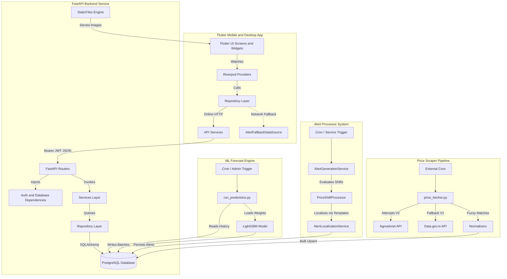
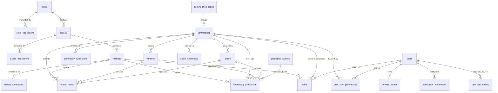
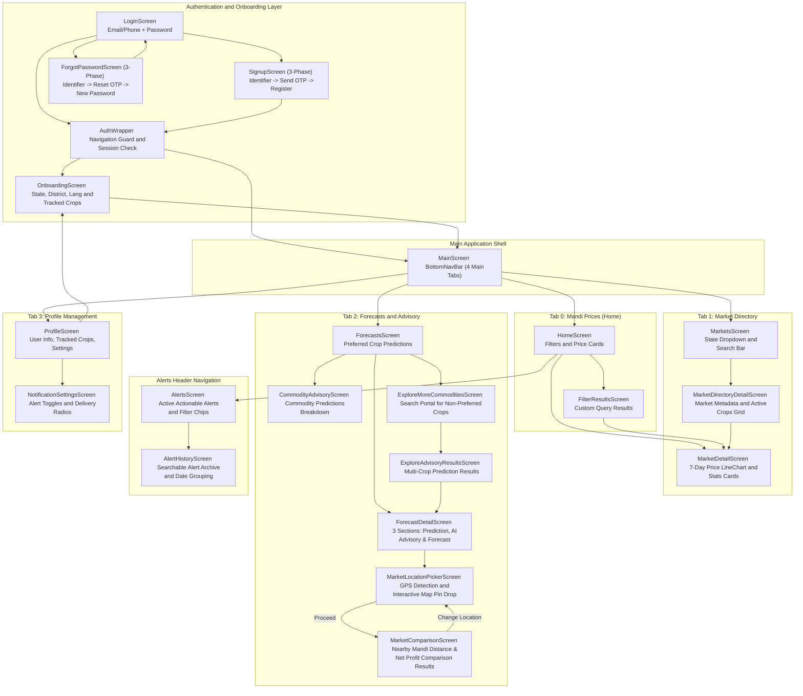
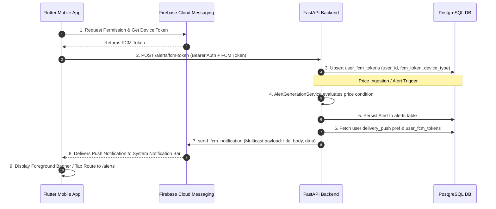

# Mandi Intelligence - Long-Term Architectural Memory
*(Last Updated: 29 August 2026)*

This document serves as the single authoritative persistent memory and comprehensive architectural blueprint of the Mandi Intelligence project. It provides complete context for future development, ensuring subsequent agent sessions do not need to rediscover the architecture, database schema, state management, predictive engine, alert pipeline, or business logic.

---

# 1. Project Overview

- **What this project does**: Mandi Intelligence is an agricultural marketplace analysis and intelligence platform. It aggregates live agricultural commodity prices from across India, normalizes them, generates 7-day machine learning price predictions, processes actionable price alerts, and delivers them via a localized mobile app (with a desktop viewport frame wrapper).
- **Primary purpose**: To empower farmers, traders, and agricultural stakeholders with real-time commodity price data, historical trends, 7-day machine learning forecasts, best selling day recommendations, and customized crop price alerts.
- **Main user flow**:
  1. **Authentication & Recovery**: User registers or logs in via OTP (Email via Resend or SMS via Fast2SMS). Registered users can also recover passwords via a 3-phase Forgot Password OTP flow.
  2. **Onboarding & Profile Setup**: New users select their State, District, preferred UI Language (English, Hindi, Malayalam), and trackable crops (crop preferences).
  3. **Real-Time Price Tracking (Home Tab)**: Displays current daily mandi prices filtered by location and preferred crops, formatted with Variety and Grade tags.
  4. **Detailed Analysis & Market Directory (Markets Tab)**: Users can inspect 7-day historical price movement charts (`fl_chart`) or browse a paginated directory of active markets in a state/district.
  5. **Predictions & Advisory (Advisory Tab)**: Displays 7-day LightGBM price predictions in a production-grade 3-section layout (Prediction Section, AI Advisory Section with transport cost, market fee & expected profit breakdown, and Forecast Section with daily timeline). Features an interactive two-step "Compare Nearby Mandis" flow (`MarketLocationPickerScreen` for GPS detection & interactive OpenStreetMap pin drop, transitioning to `MarketComparisonScreen` for results) and an "Explore More Commodities" portal to search predictions across non-preferred crops.
  6. **Actionable Alerts & History (Alerts Bell Header)**: Displays real-time actionable price alerts (`PRICE_INCREASE`, `PRICE_DROP`, `BETTER_MARKET`, `AI_RECOMMENDATION`) and searchable historical alert archives.
  7. **Profile & Notification Management (Profile Tab)**: Allows editing location, language, tracked crops, and notification preferences (Price Increase, Price Drop, AI Recommendation toggles; In-App, Email, Push delivery channels; Instant vs Daily Summary frequencies).
- **Current implementation status**:
  - **Backend**: Fully functional FastAPI service deployed on Railway. Features PostGIS spatial location engine (`latitude`, `longitude`, `location` Geography Point with GiST indexing), geocoding script (`populate_market_coordinates.py`), nearby market comparison endpoint (`/markets/compare-mock`), database migration schemas, dual-source price fetcher, fuzzy-matching normalizers, LightGBM prediction engine, template-based alert localization engine, Resend mailer, Fast2SMS gateway, and RESTful APIs.
  - **Frontend**: Production-grade Flutter app with multi-language localizations (EN, HI, ML), Riverpod state management, custom Material 3 cards, desktop frame wrapper (`MobileFrameWrapper`), production-ready Two-Step Nearby Mandi Comparison workflow (`MarketLocationPickerScreen` with GPS detection and OpenStreetMap pin drop + `MarketComparisonScreen` with 5 sort options, quantity controls, Change Location support, and Best Value badge), and dual-mode fallback repositories for offline/resilient demo operation.
- **Completed Core Modules**:
  - Authentication (OTP send/verify with transient verification tokens, login, register, me).
  - Forgot Password recovery pipeline.
  - Notification Preferences management.
  - Dual price ingestion pipeline (Agmarknet V2 Daily API + Data.gov.in V1 Fallback API).
  - Advanced fuzzy matching normalization for Markets, Commodities, and Varieties.
  - Multi-language localization (EN, HI, ML) for App UI and database-driven translations.
  - 7-day historical price timeline visualization.
  - LightGBM Machine Learning 7-day price forecasting engine.
  - Actionable & Historical Alerts System (`PRICE_INCREASE`, `PRICE_DROP`, `BETTER_MARKET`, `AI_RECOMMENDATION`).
  - Two-Step Spatial Mandi Comparison System (GPS auto-detection, OpenStreetMap pin-drop picker with Nominatim reverse geocoding, financial payout matrix with best-value ranking).

---

# 2. Tech Stack

### Frontend
- **Framework**: Flutter (Dart ^3.5.0)
- **State Management**: `flutter_riverpod` (^2.5.1)
- **Local Storage / Session**: `flutter_secure_storage` (^9.2.2) (stores JWT Bearer token)
- **Maps & Geolocation**: `flutter_map` (^8.3.2), `latlong2` (^0.10.1), `geolocator` (^14.0.2), OpenStreetMap Nominatim reverse geocoding
- **Charts**: `fl_chart` (^1.2.0) (price history & 7-day prediction trajectory)
- **Networking**: `http` (^1.2.1)
- **Localization**: `flutter_localizations` (SDK), `intl` (^0.20.2), `flutter gen-l10n`
- **Push Notifications**: `firebase_core` (^3.10.0), `firebase_messaging` (^15.2.0), `flutter_local_notifications` (^18.0.1)
- **Animations & UI**: `shimmer` (^3.0.0), `MobileFrameWrapper` (390x884 desktop viewport constraint)

### Backend
- **Framework**: FastAPI (Python)
- **Server**: Uvicorn
- **ORM / DB Access**: SQLAlchemy (PostgreSQL engine with PostGIS / `GeoAlchemy2`)
- **Geocoding & Spatial**: `geopy` (GoogleV3 geocoder), `GeoAlchemy2` (PostGIS Geography column)
- **Machine Learning**: LightGBM, Pandas, NumPy, Scikit-learn (`app/ml/lightgbm_weights.txt`, `app/ml/model_features.json`)
- **Data Fetcher**: `httpx`, `requests`
- **Config & Validation**: Pydantic / `pydantic-settings`
- **Security & Token**: Passlib (`bcrypt`), `python-jose[cryptography]` (JWT)
- **Push Notification Engine**: `firebase-admin` (SDK)
- **Email Delivery**: `resend` (SDK)
- **SMS Delivery**: `Fast2SMS` API (`SMSService`)


### Database & Deployment
- **Database**: PostgreSQL (hosted on Railway)
- **Deployment**: Railway (`mandi-intelligence-app-production`)

---

# 3. Repository Structure

```
.
├── backend/
│   ├── app/
│   │   ├── api/
│   │   │   ├── routes/             # Entity & feature routers
│   │   │   │   ├── alerts.py             # Actionable & historical alerts
│   │   │   │   ├── commodities.py        # Commodities endpoints
│   │   │   │   ├── districts.py          # Districts by state
│   │   │   │   ├── mandi_prices.py       # Daily price search & pagination
│   │   │   │   ├── market_directory.py   # Market directory index
│   │   │   │   ├── markets.py            # Markets by district
│   │   │   │   ├── predictions.py        # ML price predictions (Forecasts)
│   │   │   │   ├── price_history.py      # 7-day historical prices
│   │   │   │   └── states.py             # Active states
│   │   │   ├── auth.py                   # OTP, Register, Login, Forgot Password
│   │   │   ├── crop_preferences.py       # User tracked crops
│   │   │   ├── notification_preferences.py # Notification settings
│   │   │   └── profile.py                # Profile retrieval & updates
│   │   ├── core/                         # Config, Database, Dependencies, Security
│   │   ├── ml/                           # LightGBM weights & model feature JSON
│   │   │   ├── lightgbm_weights.txt
│   │   │   └── model_features.json
│   │   ├── models/                       # 22 SQLAlchemy DB models
│   │   ├── repositories/                 # SQL queries (mandi prices, predictions, alerts)
│   │   ├── schemas/                      # Pydantic schemas (alerts, predictions, auth, etc.)
│   │   ├── services/                     # Business logic & processors
│   │   │   ├── alert_processors/         # Price shift alert processor
│   │   │   ├── alert_generation_service.py # Alert generator dispatcher
│   │   │   ├── alert_localization.py     # Template-based alert translation
│   │   │   ├── alert_service.py          # Alert persistence & mapping
│   │   │   ├── auth_service.py           # Verification & user creation
│   │   │   ├── email_service.py          # Resend email wrapper
│   │   │   ├── otp_service.py            # OTP generator & validator
│   │   │   ├── prediction_runner.py      # ML execution interface
│   │   │   ├── prediction_service.py     # Prediction grouping & metrics
│   │   │   ├── sms_service.py            # Fast2SMS wrapper
│   │   │   └── verification_token_service.py # Hashed transient tokens
│   │   ├── static/                       # Static files server
│   │   │   └── commodity-images/         # Static images (1.jpeg, default.webp, etc.)
│   │   ├── utils/                        # Auth identifier helpers
│   │   └── main.py                       # FastAPI entrypoint & router registry
│   ├── price_fetcher.py                  # Scraper coordinator (V2 Agmarknet -> V1 Gov)
│   ├── price_fetcher_v1.py               # Gov V1 public API client
│   ├── price_fetcher_v2.py               # Agmarknet V2 JSON API client
│   ├── run_predictions.py                # Standalone LightGBM inference & batch saver
│   ├── commodity_normalizer.py           # Fuzzy matching for commodities
│   ├── market_normalizer.py              # Fuzzy matching for markets
│   ├── variety_normalizer.py             # Fuzzy matching for varieties
│   ├── commodity_aliases.py              # Alias dictionary mappings
│   ├── Data_mapping.py                   # Pre-compiled Agmarknet IDs mapping
│   ├── generate_mapping.py               # Agmarknet mapping generator
│   ├── insert_data.py                    # Mapping DB seeder
│   └── test_alerts_api.py                # Automated pytest suite for Alerts API
│
├── lib/
│   ├── core/
│   │   ├── constants/                    # ApiConstants (baseUrl, endpoints)
│   │   ├── providers/                    # localeProvider, storageProvider, authApiProvider
│   │   ├── services/                     # LocationService (GPS detection & reverse geocoding)
│   │   ├── theme/                        # AppTheme (Material 3 palettes)
│   │   └── widgets/                      # Global widgets (MobileFrameWrapper, CommodityImageWidget)
│   ├── data/
│   │   ├── datasources/                  # AlertFallbackDataSource (Offline mock engine)
│   │   ├── models/                       # Dart data models (Alert, Forecast, MandiPrice, UserProfile)
│   │   ├── repositories/                 # Repositories (AlertRepo, AuthRepo, ForecastRepo, MandiRepo)
│   │   └── services/                     # HTTP API clients (AlertApiService, AuthApiService, etc.)
│   ├── features/
│   │   ├── alerts/                       # AlertsScreen, AlertHistoryScreen, AlertCard, FilterChips
│   │   ├── auth/                         # Login, Signup, ForgotPassword, Onboarding, Profile, Settings
│   │   ├── forecasts/                    # ForecastsScreen, ForecastDetailScreen, MarketLocationPickerScreen, MarketComparisonScreen, Explore Screens
│   │   └── mandi_prices/                 # HomeScreen, FilterResultsScreen, MarketDetailScreen, MarketsScreen
│   ├── l10n/                             # ARB localizations (app_en.arb, app_hi.arb, app_ml.arb)
│   ├── main.dart                         # Flutter entrypoint & AuthWrapper
│   └── main_screen.dart                  # BottomNavBar tab navigator frame
└── test/
    └── alerts_feature_test.dart          # Automated Flutter widget & repository tests
```

---

# 4. High-Level Architecture



---

# 5. Backend Endpoints List

| Endpoint | Method | Auth | Purpose | Request Payload | Response Schema |
| :--- | :--- | :--- | :--- | :--- | :--- |
| `/auth/send-otp` | `POST` | None | Generate & dispatch signup OTP | `SendOTPRequest` | `{"message", "identifier", "registration_method"}` |
| `/auth/verify-otp` | `POST` | None | Validate OTP; issue transient token | `VerifyOTPRequest` | `{"verification_token", "token_type", "expires_in_seconds"}` |
| `/auth/forgot-password/send-otp` | `POST` | None | Send reset password OTP | `SendOTPRequest` | `{"message", "identifier", "registration_method"}` |
| `/auth/forgot-password/verify-otp` | `POST` | None | Verify reset OTP; issue reset token | `VerifyOTPRequest` | `{"verification_token", "token_type", "expires_in_seconds"}` |
| `/auth/forgot-password/reset-password` | `POST` | None | Reset password using reset token | `ResetPasswordRequest` | `{"message"}` |
| `/auth/register` | `POST` | None | Register account using token | `UserRegister` | `UserResponse` |
| `/auth/login` | `POST` | None | Authenticate credentials & return JWT | `UserLogin` | `{"access_token", "token_type", "user"}` |
| `/auth/me` | `GET` | Bearer | Get current session user profile | None | `UserResponse` |
| `/profile` | `GET` | Bearer | Get profile with state & district | None | `UserResponse` |
| `/profile` | `PUT` | Bearer | Update profile details | `UserProfileUpdate` | `UserResponse` |
| `/profile/preferences` | `GET` | Bearer | Fetch user tracked crop preferences | None | `List[CropPreferenceResponse]` |
| `/profile/preferences` | `PUT` | Bearer | Bulk update user crop preferences | `CropPreferenceUpdate` | `List[CropPreferenceResponse]` |
| `/profile/notification-preferences` | `GET` | Bearer | Retrieve notification settings | None | `NotificationPreferenceResponse` |
| `/profile/notification-preferences` | `PUT` | Bearer | Update notification settings | `NotificationPreferenceUpdate` | `NotificationPreferenceResponse` |
| `/states/` | `GET` | None | List states with active markets | Query: `language` | `List[StateSchema]` |
| `/districts/` | `GET` | None | List districts in a state | Query: `state_id`, `language` | `List[DistrictSchema]` |
| `/markets/` | `GET` | None | List markets in a district | Query: `district_id`, `language` | `List[MarketSchema]` |
| `/markets/closest` | `GET` | None | Get 10 closest markets by coordinates | Query: `lat`, `lng` | `List[ClosestMarketResponse]` |
| `/markets/compare-mock` | `GET` | None | Financial comparison across nearby mandis | Query: `lat`, `lng`, `commodity_id`, `transport_rate_per_km`, `quantity` | `MarketComparisonResponse` |
| `/markets/{id}/commodities` | `GET` | None | Active commodities in market today | Path: `market_id` | `{"market_id", "commodity_count", "commodities"}` |
| `/commodities/` | `GET` | None | List commodities with prices today | None | `List[CommoditySchema]` |
| `/commodities/active` | `GET` | None | List active trackable commodities | None | `List[CommoditySchema]` |
| `/commodities/all` | `GET` | None | List all mapped commodities | None | `List[CommoditySchema]` |
| `/mandi-prices/` | `GET` | None | Paginated search of mandi prices | Query: `state`, `district`, `market`, `commodity`, `variety`, `language`, `page`, `page_size` | `PaginatedMandiResponse` |
| `/price-history/` | `GET` | None | Get 7 latest price records | Query: `commodity`, `market`, `variety` | `List[PriceHistoryResponse]` |
| `/market-directory/` | `GET` | None | Paginated directory of active markets | Query: `state_id`, `district_id`, `commodity_id`, `search`, `language`, `page`, `page_size` | `PaginatedMarketResponse` |
| `/predictions/` | `GET` | Bearer | Get 7-day ML price predictions | Query: `commodity_id`, `market_id`, `commodity_ids`, `market_ids`, `language`, `page`, `page_size` | `PaginatedForecastResponse` |
| `/alerts` | `GET` | Bearer | Active actionable alerts for user | Query: `type`, `page`, `page_size` | `PaginatedAlertsResponse` |
| `/alerts/history` | `GET` | Bearer | Historical alerts archive | Query: `type`, `search`, `date_from`, `date_to`, `page`, `page_size` | `PaginatedAlertsResponse` |
| `/alerts/fcm-token` | `POST` | Bearer | Register user device FCM token | Body: `FCMTokenRegisterSchema` | `{"status": "success", "message": "..."}` |
| `/static/*` | `GET` | None | Serves static assets & images | Static asset path | Image file stream |


---

# 6. Database Schema

All primary database entities exist as SQLAlchemy models in `backend/app/models/`.



### Reference & Translation Tables
1. **`states`**: `id` (PK, INT), `name` (VARCHAR).
2. **`state_translations`**: `id` (PK, INT), `state_id` (FK -> `states.id`), `language_code` (VARCHAR(2)), `translated_name` (VARCHAR). Unique(`state_id`, `language_code`).
3. **`districts`**: `id` (PK, INT), `state_id` (FK -> `states.id`), `name` (VARCHAR).
4. **`district_translations`**: `id` (PK, INT), `district_id` (FK -> `districts.id`), `language_code` (VARCHAR(2)), `translated_name` (VARCHAR). Unique(`district_id`, `language_code`).
5. **`markets`**: `id` (PK, INT), `district_id` (FK -> `districts.id`), `name` (VARCHAR), `latitude` (FLOAT, Nullable), `longitude` (FLOAT, Nullable), `location` (`Geography(Point, 4326)`, Nullable). Indexed via GiST (`idx_markets_location`).
6. **`market_translations`**: `id` (PK, INT), `market_id` (FK -> `markets.id`), `language_code` (VARCHAR(2)), `translated_name` (VARCHAR). Unique(`market_id`, `language_code`).
7. **`commodities_group`**: `id` (PK, INT), `name` (VARCHAR).
8. **`commodities`**: `id` (PK, INT), `commodity_group_id` (FK -> `commodities_group.id`), `name` (VARCHAR).
9. **`commodity_translations`**: `id` (PK, INT), `commodity_id` (FK -> `commodities.id`), `language_code` (VARCHAR(2)), `translated_name` (VARCHAR). Unique(`commodity_id`, `language_code`).
10. **`varieties`**: `id` (PK, INT), `commodity_id` (FK -> `commodities.id`), `name` (VARCHAR).
11. **`grade`** (Table name: `grade`): `id` (PK, INT), `commodity_id` (FK -> `commodities.id`), `grade_name` (VARCHAR).
12. **`active_commodity`** (Table name: `active_commodity`): `id` (PK, INT), `commodity_id` (FK -> `commodities.id`, Unique, Cascade Delete).

### Transactional & Time-Series Tables
13. **`mandi_prices`**: `id` (PK, INT), `commodity_id` (FK -> `commodities.id`), `variety_id` (FK -> `varieties.id`), `grade_id` (FK -> `grade.id`), `market_id` (FK -> `markets.id`), `modal_price` (NUMERIC), `min_price` (NUMERIC), `max_price` (NUMERIC), `arrival_date` (DATE), `created_at` (TIMESTAMPTZ). Unique(`commodity_id`, `variety_id`, `grade_id`, `market_id`, `arrival_date`).
14. **`prediction_batches`**: `id` (PK, INT), `prediction_date` (DATE), `prediction_time` (VARCHAR), `model_version` (VARCHAR), `created_at` (TIMESTAMPTZ).
15. **`commodity_predictions`**: `id` (PK, INT), `batch_id` (FK -> `prediction_batches.id`), `market_id` (FK -> `markets.id`), `commodity_id` (FK -> `commodities.id`), `variety_id` (FK -> `varieties.id`), `grade_id` (FK -> `grade.id`), `prediction_day` (DATE), `predicted_price` (NUMERIC), `created_at` (TIMESTAMPTZ).

### Users & Session Tables
16. **`users`**: `id` (PK, UUID), `name` (VARCHAR), `email` (VARCHAR, Unique, Nullable), `phone_number` (VARCHAR, Unique, Nullable), `password_hash` (VARCHAR), `state_id` (FK -> `states.id`), `district_id` (FK -> `districts.id`), `preferred_market_id` (FK -> `markets.id`, Nullable), `preferred_language` (VARCHAR(20), Default='en'), `registration_method` (VARCHAR(20)), `is_verified` (BOOL), `created_at` (TIMESTAMPTZ), `updated_at` (TIMESTAMPTZ). Constraint: Exactly one of email or phone set.
17. **`user_crop_preferences`**: `user_id` (PK, FK -> `users.id`), `commodity_id` (PK, FK -> `commodities.id`).
18. **`refresh_tokens`**: `id` (PK, UUID), `user_id` (FK -> `users.id`), `token` (TEXT), `expires_at` (TIMESTAMPTZ).
19. **`otp_verifications`**: `id` (PK, UUID), `identifier` (VARCHAR), `otp_hash` (VARCHAR), `purpose` (VARCHAR), `expires_at` (TIMESTAMPTZ), `used` (BOOL), `created_at` (TIMESTAMPTZ).
20. **`verification_tokens`**: `id` (PK, UUID), `identifier` (VARCHAR), `token_hash` (VARCHAR), `purpose` (VARCHAR), `expires_at` (TIMESTAMPTZ), `used` (BOOL), `created_at` (TIMESTAMPTZ).
21. **`notification_preferences`**: `user_id` (PK, FK -> `users.id`), `price_increase` (BOOL), `price_drop` (BOOL), `better_market` (BOOL), `market_glut` (BOOL), `ai_recommendation` (BOOL), `delivery_in_app` (BOOL), `delivery_email` (BOOL), `delivery_push` (BOOL), `frequency` (VARCHAR(20), default='instant'), `created_at` (TIMESTAMPTZ), `updated_at` (TIMESTAMPTZ).
22. **`alerts`**: `id` (PK, UUID), `user_id` (FK -> `users.id`), `type` (VARCHAR(50)), `severity` (VARCHAR(20)), `title` (VARCHAR(255)), `message` (TEXT), `commodity_id` (FK -> `commodities.id`), `market_id` (FK -> `markets.id`), `current_price` (FLOAT, Nullable), `previous_price` (FLOAT, Nullable), `change_percent` (FLOAT, Nullable), `created_at` (TIMESTAMPTZ).
23. **`user_fcm_tokens`**: `id` (PK, UUID), `user_id` (FK -> `users.id`, Cascade Delete), `fcm_token` (VARCHAR(500), Unique), `device_type` (VARCHAR(20), default='android'), `created_at` (TIMESTAMPTZ), `updated_at` (TIMESTAMPTZ). Index on `user_id`.


---

# 7. Frontend Architecture & Screen Layout



---

# 8. State Management

The frontend utilizes **Riverpod** (`flutter_riverpod`) for reactive state management and caching.

### Auth & User Providers
- `authProvider` (`auth_provider.dart`): `NotifierProvider<AuthNotifier, AuthState>`. Controls authentication status, active user profile, login, registration, and forgot password steps.
- `localeProvider` (`locale_provider.dart`): `StateNotifierProvider<LocaleNotifier, Locale>`. Manages active language locale (`en`, `hi`, `ml`).
- `profileNotifierProvider` (`profile_notifier.dart`): `AutoDisposeAsyncNotifierProvider<ProfileNotifier, UserProfile?>`. Caches user profile data from `/profile`.
- `preferredCropsNotifierProvider` (`profile_notifier.dart`): `AutoDisposeAsyncNotifierProvider<PreferredCropsNotifier, List<Map<String, dynamic>>>`. Caches tracked crop IDs from `/profile/preferences`.
- `editProfileDataProvider` (`edit_profile_data_provider.dart`): `FutureProvider.autoDispose<EditProfileData>`. Combines profile state, crop preferences, and location dropdowns.

### Mandi Prices Providers
- `mandiPricesProvider` (`mandi_prices_provider.dart`): `StateNotifierProvider.family<MandiPricesNotifier, AsyncValue<MandiPricesState>, Filter>`. Handles paginated daily price searches. Automatically refetches on locale changes to update translated entity names.
- `marketDirectoryProvider` (`mandi_prices_provider.dart`): Manages paginated market directory indexing.
- `statesProvider`, `districtsProvider`, `marketsProvider`, `marketsListProvider`: Location lookup providers reactive to `localeProvider`.

### Forecasts & Predictions Providers
- `forecastRepositoryProvider` (`forecast_provider.dart`): Injects `ForecastRepository`.
- `forecastsNotifierProvider` (`forecast_provider.dart`): `StateNotifierProvider<ForecastsNotifier, AsyncValue<PaginatedForecastResponse>>`. Watches `preferredCropsNotifierProvider` and `forecastsFilterProvider` to fetch 7-day price forecasts.
- `explorePredictionsProvider` (`forecast_provider.dart`): `FutureProvider.family<PaginatedForecastResponse, ExplorePredictionsParams>`. Fetches predictions for explored non-preferred commodities.
- `preferredCommoditiesProvider` (`forecast_provider.dart`): Resolves preferred crop IDs to localized `Commodity` objects.

### Alerts Providers
- `alertRepositoryProvider` (`alert_providers.dart`): Injects `AlertRepository` with transparent HTTP API client and fallback offline data source (`AlertFallbackDataSource`).
- `alertsNotifierProvider` (`alert_providers.dart`): `StateNotifierProvider<AlertsNotifier, AlertsState>`. Manages active alerts list, filter chips (`All`, `Better Market`, `Price Increase`, `Price Drop`, `AI Recommendation`), pagination, and pull-to-refresh.
- `alertHistoryNotifierProvider` (`alert_providers.dart`): `StateNotifierProvider<AlertHistoryNotifier, AlertHistoryState>`. Manages searchable alert archives, date filters, and presentation-layer date grouping ("Today", "Yesterday", "8 August 2026", etc.).

---

# 9. Models & Schemas

### Frontend Data Models (`lib/data/models/`)
- `UserProfile` (`user_profile.dart`): User details model (`hasCompletedProfile` check).
- `MandiPrice` (`mandi_price.dart`): Price record with `grade`, `variety`, `minPrice`, `maxPrice`, `modalPrice`, `arrivalDate`, and `getDisplayCommodity()`.
- `CommodityForecast` (`forecast_model.dart`): 7-day ML prediction containing `commodityId`, `commodityName`, `varietyName`, `gradeName`, `marketName`, `districtName`, `stateName`, `currentPrice`, `forecast` (`List<ForecastDay>`), `trend` (`Rising`/`Falling`/`Stable`), `bestSellDate`, `expectedPeakPrice`, `recommendation` (`Sell Today`/`Wait`/`Hold`), `transportCost`, `marketFee`, `expectedProfit`, `recommendationReason`, `aiRecommendationTitle`.
- `PaginatedForecastResponse` (`forecast_model.dart`): Container for paginated predictions.
- `Alert` (`alert_model.dart`): Actionable alert object containing `id`, `type`, `severity`, `title`, `message`, `commodity`, `market`, `price` (`current`, `previous`, `changePercent`), `createdAt`.
- `PaginatedAlertsResponse` (`alert_model.dart`): Container for paginated alerts. Defensively filters out any `MARKET_GLUT` entries.
- `NotificationPreferences` (`notification_preferences.dart`): Delivery channel toggles and frequency (`instant` vs `daily_summary`).

### Backend Schemas (`backend/app/schemas/`)
- `UserResponse`, `UserRegister`, `UserLogin`, `SendOTPRequest`, `VerifyOTPRequest`, `ResetPasswordRequest` (`user.py`).
- `StateSchema`, `DistrictSchema`, `MarketSchema` (`location.py`).
- `MandiPriceSchema`, `PaginatedMandiResponse` (`mandi_price.py`).
- `ForecastResponse` (includes `transport_cost`, `market_fee`, `expected_profit`, `recommendation_reason`, `ai_recommendation_title`), `PaginatedForecastResponse` (`prediction.py`).
- `AlertSchema`, `PaginatedAlertsResponse`, `AlertCreateSchema`, `AlertType`, `AlertSeverity` (`alert.py`).
- `NotificationPreferenceResponse`, `NotificationPreferenceUpdate` (`notification_preference.py`).

---

# 10. Services & Processing Logic

### Authentication & Security Services
1. **`AuthService`** (`auth_service.py`): Handles email/phone normalization, OTP dispatching, verification token generation, password hashing, and user creation.
2. **`OTPService`** (`otp_service.py`): Generates cryptographically secure 6-digit OTP codes, bcrypts them before database storage, and validates 5-minute expiry windows.
3. **`VerificationTokenService`** (`verification_token_service.py`): Generates 32-character URL-safe verification tokens, hashes them in the database, and enforces 10-minute validity.
4. **`EmailService`** (`email_service.py`): Resend SDK wrapper for sending transactional emails containing OTPs.
5. **`SMSService`** (`sms_service.py`): Fast2SMS API wrapper (`https://www.fast2sms.com/dev/bulkV2`) for dispatching SMS OTPs (with console print fallback during dev).

### Machine Learning & Prediction Services
6. **`PredictionRunner`** (`prediction_runner.py`): Programmatic trigger interface that invokes `run_predictions.py`.
7. **`PredictionService`** (`prediction_service.py`): Fetches raw predictions from `prediction_batches` and `commodity_predictions`, groups chronological days by `(commodity_id, market_id, variety_id, grade_id)`, computes peak price, best selling day, trend, and recommendation, and localizes names via translation tables.

### Alert Engine & Localization Services
8. **`AlertGenerationService`** (`alert_generation_service.py`): Dispatches alert processors (`PriceShiftProcessor`, etc.) to evaluate price shifts and persist new alerts into the `alerts` table.
9. **`AlertLocalizationService`** (`alert_localization.py`): Multi-language alert template renderer (EN, HI, ML) with in-memory translation caches for commodities and markets.
10. **`AlertService`** (`alert_service.py`): Manages database queries for active alerts, searchable history, and deterministic sorting (`created_at desc, id desc`).

---

# 11. Machine Learning & Prediction Pipeline

The predictive intelligence module estimates future modal prices for 7 days into the future.

```
[Raw mandi_prices DB records] ──► [Feature Engineering: 7-day Lags, Rolling Averages, Seasonality]
                                                   │
                                                   ▼
                                       [LightGBM Model Weights]
                                                   │
                                                   ▼
                                 [Generated 7-Day Forecast Batch]
                                                   │
                                                   ▼
                                [prediction_batches & commodity_predictions]
```

- **Model Engine**: LightGBM regression model with weights stored in `backend/app/ml/lightgbm_weights.txt` and feature specifications in `model_features.json`.
- **Feature Engineering**: Calculates historical lag features (lag_1, lag_7), rolling mean/std statistics, seasonal day-of-year indicators, and trend direction encodings.
- **Execution Script**: `backend/run_predictions.py` executes full batch predictions across all active commodity-market-variety-grade combinations and writes records to `prediction_batches` and `commodity_predictions`.
- **Production Business Logic Computation**:
  1. **Inputs**:
     - `current_price`: Latest actual modal price from `mandi_prices` table.
     - `forecast[]` & `forecast_dates[]`: 7-day predicted prices and dates.
     - `prediction_batch`: Latest valid batch record.
  2. **Trend (with ±2% Tolerance)**:
     - `change_pct = ((last_price - first_price) / first_price) * 100`
     - `change_pct >= +2.0%` $\rightarrow$ `RISING`
     - `change_pct <= -2.0%` $\rightarrow$ `FALLING`
     - Otherwise $\rightarrow$ `STABLE`
  3. **Expected Peak & Best Sell Date**:
     - `expected_peak_price = max(forecast_prices)`
     - `best_sell_date = first date having expected_peak_price`
  4. **Expected Upside %**:
     - `upside_pct = ((expected_peak_price - current_price) / current_price) * 100` (evaluates whether waiting is worthwhile).
  5. **Selling Window**:
     - Forecast dates where `price >= expected_peak_price * 0.98` (dates within 2% of the predicted peak).
  6. **Recommendation Matrix**:
     - 🔴 **`SELL TODAY`**: If `current_price >= expected_peak_price * 0.98` OR (`trend == FALLING` AND `expected_upside_pct <= 2%`).
     - 🟢 **`WAIT`**: If `expected_upside_pct > 2%` AND `selling_window` occurs in the future (at least one window date > today) AND `trend == RISING`.
     - 🟡 **`HOLD`**: If `abs(expected_upside_pct) <= 2%` AND `trend == STABLE`.
     - ⚪ **`NO CLEAR SIGNAL`**: If forecast data is incomplete, highly volatile ($CV > 0.4$), or `current_price` is missing/stale ($current\_price \le 0$).
  7. **Final Response Contract**:
     Produces `current_price`, `forecast`, `trend`, `expected_peak_price`, `best_sell_date`, `selling_window`, `expected_upside_pct`, `recommendation`, `data_quality`, `transport_cost`, `market_fee`, `expected_profit`, `recommendation_reason`, and `ai_recommendation_title`.

---

# 12. Actionable Alerts & Notification System

Conforms strictly to the **Alerts API — v1 Contract**.

### Alert Types & Scope
- **Supported Types**: `PRICE_INCREASE`, `PRICE_DROP`, `BETTER_MARKET`, `AI_RECOMMENDATION`.
- **Explicit Exclusion**: `MARKET_GLUT` is explicitly **OUT OF SCOPE**. Any request containing `type=MARKET_GLUT` is rejected by the backend with `HTTP 400 Bad Request`.
- **Backend Architecture**:
  - `Alert` SQLAlchemy model mapping to `alerts` table.
  - `AlertService` providing `get_user_alerts` and `get_user_alert_history` with full-text SQL search across titles, messages, commodities, and markets.
  - `AlertGenerationService` coordinating `PriceShiftProcessor` instances.
  - `AlertLocalizationService` applying localized message templates (`en`, `hi`, `ml`).
- **Frontend Architecture**:
  - `AlertRepository` transparently attempts the real `/alerts` HTTP API. On network failures or offline demo scenarios, it seamlessly falls back to `AlertFallbackDataSource` (which provides realistic mock alerts for Tomato in Thrissur, Coconut in Kozhikode, Potato in Palakkad).
  - `AlertsScreen` renders active alerts with filter chips (`All`, `Price Increase`, `Price Drop`, `AI Recommendation`).
  - `AlertHistoryScreen` renders searchable archives with date range bounds and presentation-layer date grouping ("Today", "Yesterday", "8 August 2026", etc.).

### Push Notification Architecture (Firebase Cloud Messaging - FCM)



- **Backend Push Engine**:
  - **Model**: `UserFCMToken` (`user_fcm_token.py`) mapping to `user_fcm_tokens` table.
  - **Service**: `firebase_service.py` initialized via Firebase Admin SDK. Supports credential loading via `FIREBASE_CREDENTIALS_JSON` environment variable string or `FIREBASE_CREDENTIALS_PATH` file path with intelligent candidate location resolution.
  - **Delivery Integration**: Integrated in `AlertService._send_alert_push_notification()` within `create_alert()`. Checks user `delivery_push` preference in `notification_preferences` and sends FCM multicast push notifications to all active user device tokens.
  - **Endpoint**: `POST /api/alerts/fcm-token` registers or updates device tokens for authenticated users.

- **Frontend Push Engine**:
  - **Service**: `PushNotificationService` (`lib/core/services/push_notification_service.dart`).
  - **Initialization**: Triggered automatically post-authentication in `AuthWrapper` (`main.dart`).
  - **Permissions & Sync**: Prompts Android 13+ `POST_NOTIFICATIONS` runtime dialog, obtains FCM token, posts token to backend API, and listens for token refresh events.
  - **Foreground & Background Handlers**: Uses `flutter_local_notifications` for foreground pop-up banners and `@pragma('vm:entry-point') firebaseMessagingBackgroundHandler` for background/terminated notification handling. Tapping notification routes user directly to `/alerts`.

---


# 13. Data Ingestion Engine

`backend/price_fetcher.py` runs scheduled price ingestion:

1. Loads active commodities from `active_commodity`.
2. Resolves commodity parameters using `Data_mapping.py` generated by `generate_mapping.py`.
3. Calls **Agmarknet V2 Daily API** (`https://api.agmarknet.gov.in/v1/daily-price-arrival/report`) via JSON POST.
4. If V2 fails (timeout, 5xx server error, or rate limit), falls back to **Gov V1 Public API** (`https://api.data.gov.in/resource/9ef84268-d588-465a-a308-a864a43d0070`) using API Key authentication.
5. Ingested records pass through `validate_records()`.
6. Fuzzy normalizers map string text to database foreign key IDs (`commodity_id`, `market_id`, `variety_id`, `grade_id`).
7. Performs bulk upserts into `mandi_prices` using PostgreSQL `on_conflict_do_update` on constraint `mandi_prices_unique`.

---

# 14. Authentication, Recovery & Profile Lifecycle

### 1. User Registration Flow
```
User (Email/Phone) ──► /auth/send-otp ──► [Resend Email / Fast2SMS]
                                                │
User enters OTP ◄───────────────────────────────┘
       │
       ▼
/auth/verify-otp ──► Returns hashed transient verification_token (10 min expiry)
       │
       ▼
/auth/register (Provides Name, Password, verification_token) ──► Account Created & User Logged In
```

### 2. Password Recovery Flow
```
User ──► /auth/forgot-password/send-otp ──► [Dispatches Reset OTP]
                                                   │
User enters OTP ◄──────────────────────────────────┘
       │
       ▼
/auth/forgot-password/verify-otp ──► Returns transient reset token
       │
       ▼
/auth/forgot-password/reset-password (New Password + Token) ──► Password Updated & Navigates to Login
```

### 3. Session Guard
`AuthWrapper` (`main.dart`) checks `authProvider`. If user is unauthenticated -> `LoginScreen`. If profile is incomplete (`state_id == null || district_id == null`) -> `OnboardingScreen`. Otherwise -> `MainScreen`.

---

# 15. Localization Architecture

- **Database Entity Translations**:
  - State names in `state_translations`.
  - District names in `district_translations`.
  - Market names in `market_translations`.
  - Commodity names in `commodity_translations`.
  - API endpoints accept `?language=en`, `?language=hi`, or `?language=ml` query parameters, performing SQL joins on translation tables and falling back to English columns when translation rows are absent.
- **Frontend App UI Translations**:
  - Defined in ARB files: `lib/l10n/app_en.arb`, `app_hi.arb`, `app_ml.arb`.
  - Generated into `AppLocalizations` via `flutter gen-l10n`.
  - Active locale stored in `localeProvider`. Changing locale dynamically re-triggers API providers to fetch localized data.

---

# 16. External APIs & Third-Party Integrations

1. **Agmarknet V2 Daily API**: `https://api.agmarknet.gov.in/v1/daily-price-arrival/report` (Primary price scraper).
2. **Gov V1 Public API**: `https://api.data.gov.in/resource/9ef84268-d588-465a-a308-a864a43d0070` (Fallback price scraper, requires `api-key`).
3. **Resend SMTP Email API**: Dispatches OTP verification emails. Requires `RESEND_API_KEY`.
4. **Fast2SMS Bulk V2 API**: `https://www.fast2sms.com/dev/bulkV2` (SMS OTP dispatcher). Requires `FAST2SMS_API_KEY`.

---

# 17. Important Constants & Configuration

### Environment Variables (`backend/.env`)
- `DATABASE_URL`: Hosted PostgreSQL connection URL.
- `SECRET_KEY`: Used for JWT signing.
- `API_KEY`: Gov data API key.
- `RESEND_API_KEY`: API key for email delivery.
- `FAST2SMS_API_KEY`: API key for Fast2SMS gateway.
- `SMTP_HOST`, `SMTP_PORT`, `SMTP_EMAIL`, `SMTP_PASSWORD`: Fallback SMTP configuration.

### Frontend Base Constants (`lib/core/constants/api_constants.dart`)
- `baseUrl`: `https://mandi-intelligence-app-production.up.railway.app`
- Static images base route: `/static/commodity-images/{commodityId}.jpeg`

---

# 18. Common Development Tasks

### 1. Adding a New API Endpoint
- **Backend**:
  1. Define Pydantic schema in `backend/app/schemas/`.
  2. Implement route logic in relevant file under `backend/app/api/routes/` or new router.
  3. Register router in `backend/app/main.py` using `app.include_router()`.
- **Frontend**:
  1. Define model in `lib/data/models/`.
  2. Implement HTTP call in service under `lib/data/services/`.
  3. Expose method in repository under `lib/data/repositories/`.
  4. Create Riverpod provider in relevant feature `providers/`.

### 2. Adding a Database Entity
- **Backend**:
  1. Create SQLAlchemy model in `backend/app/models/`.
  2. Export model in `backend/app/models/__init__.py`.
  3. Run `python create_tables.py` or execute `Base.metadata.create_all()`.

---

# 19. Technical Debt, Gotchas & Key Design Decisions

1. **Desktop Viewport Wrapper (`MobileFrameWrapper`)**: On web or desktop browsers (screen width > 450px), `MobileFrameWrapper` wraps the app in a realistic 390x884 mobile device mockup frame with dark slate background and subtle glows, ensuring UI visual consistency across all viewports.
2. **Singular Database Table Names**: Note that `grade` and `active_commodity` are named singular in PostgreSQL. All other tables (`states`, `districts`, `markets`, `commodities`, `varieties`, `mandi_prices`, `users`, `alerts`, `prediction_batches`, `commodity_predictions`, `notification_preferences`) are named plural.
3. **`MARKET_GLUT` Exclusion**: `MARKET_GLUT` is explicitly excluded across backend validators, repositories, UI filter chips, and data models. Querying `MARKET_GLUT` returns `HTTP 400 Bad Request`.
4. **Dual-Mode Fallback Repository Pattern**: To guarantee seamless demo execution and offline resilience, `AlertRepository` transparently falls back to `AlertFallbackDataSource` if API network requests fail or time out.
5. **Transient Verification Tokens**: `auth/verify-otp` returns a cryptographically hashed 10-minute token. Registration calls (`/auth/register`) require this token, ensuring account creation originates from verified email/phone numbers.
6. **In-Memory Reference Dictionary Caching**: `price_fetcher.py` loads entities into memory maps to achieve $O(1)$ lookup times during high-volume fuzzy matching normalization.
7. **FastAPI Lifespan Tasks**: Commented out inside `main.py` to prevent startup context blocking. Data fetching (`price_fetcher.py`), prediction execution (`run_predictions.py`), and alert processing (`scripts/run_alert_generation.py`) are triggered via external cron or administrative CLI scripts.

---

# 20. Offline Cache Implementation

- **Engine**: **`SharedPreferences`** (`shared_preferences: ^2.3.2`) for persistent key-value caching. Provides 100% cross-platform compatibility across Web (`dart2js` / WASM / LocalStorage), Android, iOS, Windows, macOS, and Linux without native FFI dependencies or 64-bit integer hash web compiler errors. Authentication tokens remain securely isolated in `flutter_secure_storage`.
- **Supported Screens**:
  - **Home Screen**: Caches Mandi Prices (`getMandiPrices`), States (`getStates`), Districts (`getDistricts`), Markets (`getMarketsList`), and Commodities (`getCommodities`, `getActiveCommodities`).
  - **Profile Screen**: Caches User Profile (`getProfile`) and Preferred Crops (`getPreferredCrops`).
  - **Explicit Scope Limitation**: Forecasts, Alerts, Markets Directory, Explore, and other screens are **NOT** yet cached.
- **Cache Key Strategy**:
  - `mandi_prices_state={state}_dist={district}_mkt={market}_crop={crop}_lang={language}_p={page}_ps={pageSize}`
  - `states_lang={language}`
  - `districts_state={state}_id={stateId}_lang={language}`
  - `markets_distId={districtId}_lang={language}`
  - `commodities_type={all|active}`
  - `user_profile`
  - `preferred_crops`
- **Cache Freshness & Timestamping**:
  - Every cached entry records `cachedAt` (`DateTime`).
  - UI renders instant cached data with `cachedAt` timestamp, then executes background API refresh.
- **Online-First & Offline Fallback Strategy**:
  - **Online**: API call succeeds $\rightarrow$ returns fresh data $\rightarrow$ updates local cache.
  - **Offline / API Failure**: API call fails $\rightarrow$ reads cache $\rightarrow$ if cached data exists, returns cached data seamlessly without error screens. If no cache exists, displays standard error state.
  - **Write Operations**: Profile edits (`updateProfile`, `savePreferredCrops`) remain online-only. Offline attempts do not fake synchronization and cleanly present network-required errors.
- **Cache Indicator UI**:
  - Displays a subtle warning banner at the top of Home Screen when data is served from local cache (`Offline · Last synced X ago` / localized in EN, HI, ML).
  - Automatically disappears when fresh network data arrives.
- **Exact Files Created / Modified**:
  - **Created**:
    - `lib/data/models/cache/cached_entry.dart` (`CachedEntry` model holding `cacheKey`, `rawJson`, `cachedAt`)
    - `lib/data/services/local_cache_service.dart` (`LocalCacheService` using `SharedPreferences`)
  - **Modified**:
    - `pubspec.yaml` (Added `shared_preferences: ^2.3.2`)
    - `lib/data/repositories/mandi_repository.dart` (Online-first & fallback for mandi prices, states, districts, markets, commodities)
    - `lib/data/repositories/auth_repository.dart` (Online-first & fallback for user profile and preferred crops)
    - `lib/core/providers/providers.dart` (Registered `localCacheServiceProvider` and injected into `authRepositoryProvider`)
    - `lib/features/mandi_prices/providers/mandi_prices_provider.dart` (Added `isFromCache` and `cachedAt` to `MandiPricesState`, instant render + background refresh in `MandiPricesNotifier`)
    - `lib/l10n/app_en.arb`, `app_hi.arb`, `app_ml.arb` (Added `offlineLabel` and `lastSyncedLabel`)
    - `agent_helper.md` (Updated architectural documentation)

---

# 21. Shared Notification Bell & Unread Badge Architecture

- **Home Screen Notification Bell**: Positioned in the upper-right app bar actions of `HomeScreen` using `NotificationBell`.
- **Advisory / Forecasts Screen Notification Bell**: Positioned in the header of `ForecastsScreen` using `NotificationBell` styled with the cream/orange circular container theme.
- **Shared Unread-Count State**: Both bells consume a single shared Riverpod provider: `unreadAlertCountProvider` (`lib/features/alerts/providers/alert_providers.dart`).
- **Badge Behavior**:
  - `0`: No badge rendered.
  - `1–9`: Small red circular badge displaying the exact integer count (e.g., `1`, `3`, `9`).
  - `10+`: Small red pill badge displaying `"9+"`.
- **Navigation & Read Behavior**:
  - Tapping either bell navigates to the existing `AlertsScreen` via standard `Navigator.push`.
  - Opening `AlertsScreen` triggers `markAsRead()`, resetting the shared in-memory `unreadCount` to `0` across both bells simultaneously.
- **Source of Unread Data**:
  - Derived in-memory from `alertsNotifierProvider` (which fetches active alerts from `/alerts`).
- **Push & FCM Architecture**:
  - FCM (Firebase Cloud Messaging) push notifications for Android & iOS are fully implemented via `FirebaseMessaging`, `flutter_local_notifications`, and backend `firebase-admin` SDK. Tapping a push notification routes users directly to `AlertsScreen`.


---

# 22. Offline Authentication / Session Persistence Architecture

- **JWT Secure Storage**: User JWT access tokens are stored securely on the device using `flutter_secure_storage`.
- **Offline Session Persistence**:
  - Network failures (timeouts, `SocketException`, connection errors, offline status) during startup or session restoration do **NOT** log the user out.
  - The app preserves the locally stored JWT token and keeps the user's `AuthState.isAuthenticated` state set to `true`.
  - MainScreen opens seamlessly and utilizes existing offline-cached profile and mandi price data.
- **Cached User Profile Usage**:
  - When offline, `getCurrentUser()` and `_checkAuth()` retrieve the existing cached profile from `LocalCacheService` (`user_profile` key) to restore user locale and initial state.
- **Explicit Auth Rejection Handling**:
  - Explicit HTTP `401 Unauthorized` or `403 Forbidden` responses from the backend throw `UnauthorizedException`, which triggers `logout()` and clears the invalid JWT token to present `LoginScreen`.
- **Security Guarantee**:
  - No user passwords are stored locally on the device.
  - JWT security is fully preserved without bypassing explicit token invalidation from the backend.

---

# 23. Alert Email Delivery Architecture

- **Resend Integration**: Alert emails are delivered through the project's existing Resend service (`resend.Emails.send`).
- **Extended `email_service.py`**: `EmailService.send_alert_email()` adds smart alert email delivery while preserving `send_otp_email()` intact.
- **Independent Delivery Channel**:
  - Alert creation in PostgreSQL database (`AlertRepository.create_alert`) is completely independent of email delivery.
  - If Resend API calls fail, network timeouts occur, or the user lacks an email address, the error is logged and caught gracefully without rolling back or failing alert creation.
- **Multilingual Support**:
  - Templates use the user's `preferred_language` (`en`, `hi`, `ml`) from the `users` table to select localized subjects and HTML content.
  - Supports English, Hindi, and Malayalam templates for all alert types (`PRICE_INCREASE`, `PRICE_DROP`, `MARKET_GLUT`, `SELLING_OPPORTUNITY`, `BETTER_MARKET`, `AI_RECOMMENDATION`).
- **User Validation & Preferences**:
  - Email delivery is only attempted when `user.email` is present. Users registered via phone without an email address are cleanly skipped.
  - Respects user notification preferences (`delivery_email` in `notification_preferences`).
- **Backend-Only Channel**:
  - Email delivery is triggered internally on FastAPI backend upon alert generation. `RESEND_API_KEY` remains strictly server-side.
  - Automated alert generation in GitHub Actions (`generate_alerts.yml`) provisions the necessary secrets (`RESEND_API_KEY`, `SECRET_KEY`, `API_KEY`) to support headless email delivery without application server dependencies.
- **FCM & SMS Disclaimer**:
  - FCM push notifications and SMS delivery are **NOT** implemented in this change.


---

# 24. Nearby Mandi Comparison & Two-Step Spatial Location Engine

*(Last Updated: 29 August 2026)*

Provides a complete two-step spatial analysis and multi-mandi financial payout comparison engine for farmers evaluating selling locations.

### Two-Step User Flow Architecture
1. **Screen 1 (Location Selection Screen - `MarketLocationPickerScreen`)**:
   - Takes location input **only** without rendering comparison results upfront.
   - **Detect Current Location (GPS)**: One-tap button calling `LocationService.determinePosition()` with device permission checks, GPS service validation, and real-time status feedback.
   - **Interactive Map Pin Drop**: High-performance `FlutterMap` powered by OpenStreetMap tile layers (free, zero API key dependencies). Users can pan, zoom, and tap anywhere on the map to place or reposition the pin marker with live visual feedback.
   - **Reverse Geocoding**: Asynchronously calls OpenStreetMap Nominatim reverse geocoding API to resolve human-readable place/district/state names from pin coordinates.
   - **Confirmation Action**: "Compare Mandis for This Location" validates coordinates and redirects to Screen 2.

2. **Screen 2 (Comparison Results Screen - `MarketComparisonScreen`)**:
   - Computes distance matrix, transport costs, and net payouts for the user-selected coordinates (instead of hardcoded defaults).
   - Features 5 sort options (`MarketSortOption`), dynamic quantity increment/decrement, and a prominent 🏆 **BEST VALUE** badge on the highest net payout mandi.
   - **Dynamic Location Change**: Tapping "Change" in the top location card re-opens `MarketLocationPickerScreen` in change mode. Selecting a new pin or detecting GPS immediately updates the results screen and re-runs comparison for the newly chosen location.

### Financial Calculations Matrix

| Metric | Formula |
| :--- | :--- |
| **Distance ($D$)** | Spherical distance between user coords $(lat_u, lng_u)$ & Mandi coords $(lat_m, lng_m)$ in kilometers via PostGIS `ST_Distance`. |
| **Selling Price ($P$)** | Latest `modal_price` per quintal (₹/qtl) for target commodity. |
| **Transport Cost ($C_t$)** | $D \times \text{Transport Rate per km per quintal}$ *(e.g., ₹2.5 / km / qtl)*. |
| **Mandi Commission ($C_m$)** | $P \times 1\%$ *(Standard 1% market fee)*. |
| **Net Profit ($P_{net}$)** | $P - (C_t + C_m)$ per quintal. |
| **Total Net Profit ($P_{total}$)** | $P_{net} \times \text{Quantity (quintals)}$. |
| **Best Value Badge** | Mandi with the **highest $P_{net}$** among nearby mandis. |

### Components & Services
- **Location Service**: `lib/core/services/location_service.dart` (`LocationService.determinePosition()`, `LocationService.reverseGeocode()`, `UserLocationResult`).
- **Location Picker Screen**: `lib/features/forecasts/screens/market_location_picker_screen.dart` (`MarketLocationPickerScreen`, OpenStreetMap `FlutterMap`, GPS detection, animated pin marker, reverse geocoding banner).
- **Comparison Results Screen**: `lib/features/forecasts/screens/market_comparison_screen.dart` (`MarketComparisonScreen`, location bar, quantity controls, sort chips, `NearbyMandiCard` with 🏆 BEST VALUE badge).
- **Riverpod State**: `lib/features/forecasts/providers/market_comparison_provider.dart` (`marketComparisonProvider`, `MarketSortOption` enum with 5 options: `bestValue`, `netProfit`, `sellingPrice`, `distance`, `lowestTransport`).
- **Data Models**: `lib/data/models/market_comparison_model.dart` (`MarketComparisonItem`, `MarketComparisonResponse`).
- **Permissions**: `android/app/src/main/AndroidManifest.xml` (`ACCESS_FINE_LOCATION`, `ACCESS_COARSE_LOCATION`, `INTERNET`).
- **API Endpoint**: `GET /markets/compare` in `lib/data/services/mandi_api_service.dart`.

---

# 25. Technical Documentation Website Pipeline

Added on **27 August 2026**:

- **Source of Truth**: `agent_helper.md` is the single source of truth for all project architecture and technical documentation.
- **Automated Generation**: The documentation website is generated automatically via `scripts/build_docs.py` into `docs/index.html`.
- **Mermaid Rendering**: All Mermaid diagrams (`flowchart TD`, `erDiagram`, `flowchart TB`) are preserved and rendered visually using Mermaid.js.
- **GitHub Actions & Pages**: `.github/workflows/docs.yml` automatically rebuilds and deploys the documentation website to GitHub Pages on every `git push` to the `main` branch.
- **README Integration**: `README.md` includes a prominent `## 📚 Technical Documentation` link pointing to the live GitHub Pages site.

---

# 26. Notification Settings & Alert UI Refinements

Added on **29 August 2026**:

Refined the notification preferences management and alert filtering interfaces:

### 1. Database Schema & Backend Model Preservation
- **No Schema Changes**: The PostgreSQL table `notification_preferences` and SQLAlchemy models remain completely unchanged.
- **Field Integrity**: `better_market` is preserved in the database schema, backend schemas (`NotificationPreferenceBase`, `NotificationPreferenceUpdate`, `NotificationPreferenceResponse`), and Dart model (`NotificationPreferences`) with its existing value, preventing schema breakage.

### 2. Notification Settings Screen (`NotificationSettingsScreen`)
- **Alert Types Section**:
  - **`priceIncrease`**: Added as an independent toggle (uses `Icons.trending_up` and localized string `priceIncrease`).
  - **`priceDrop`**: Retained as an independent toggle (uses `Icons.trending_down` and localized string `priceDrop`).
  - **`aiRecommendation`**: Retained as an independent toggle (uses `Icons.auto_awesome` and localized string `aiRecommendation`).
  - **`betterMarket`**: Removed from the UI toggles. State is preserved when saving via `current.betterMarket`.
- **Delivery Section**:
  - **`deliveryInApp`**: In-App Notifications toggle (`Icons.notifications_none_outlined`).
  - **`deliveryEmail`**: Email Notifications toggle (`Icons.mail_outline_rounded`, localized string `emailNotifications`). Connects to existing database column `delivery_email`.
  - **`deliveryPush`**: Push Notifications toggle (`Icons.smartphone_outlined`).

### 3. Alerts Screen & Alert History Screen Filter Chips
- **Filter List (`AlertFilterChips`)**: Updated to `['ALL', AlertTypes.priceIncrease, AlertTypes.priceDrop, AlertTypes.aiRecommendation]`.
- **Better Market Filter Removal**: `AlertTypes.betterMarket` removed from filter chips across both `AlertsScreen` and `AlertHistoryScreen`.

---

# 27. FCM Push Notification Architecture & Multi-Channel Alert Integration

Added on **30 August 2026**:

Implemented real-time push notification delivery for Mandi Intelligence alerts via Firebase Cloud Messaging (FCM), integrated across both the Python FastAPI backend and Flutter mobile client.

### 1. Architectural Highlights
- **End-to-End Multicast Push**: Alerts generated by `AlertService.create_alert()` automatically dispatch push notifications via `firebase-admin` to all FCM tokens registered by the targeted user.
- **Resilient Fallback Design**: If Firebase credentials are not configured or network failures occur, push delivery logs a warning and gracefully fails without rolling back alert creation or disrupting email delivery.
- **Smart Credential Resolution**: Backend `firebase_service.py` supports credential loading via `FIREBASE_CREDENTIALS_JSON` environment variable string or `FIREBASE_CREDENTIALS_PATH` file path with intelligent candidate location resolution.
- **Desugaring & Android 13+ Compliance**: Enabled `isCoreLibraryDesugaringEnabled = true` with `desugar_jdk_libs:2.0.4` in `android/app/build.gradle.kts` and added `POST_NOTIFICATIONS` runtime permission in `AndroidManifest.xml`.

### 2. Database Schema Extension
- **`user_fcm_tokens`**: Stores registered FCM device tokens (`id`, `user_id` FK -> `users.id`, `fcm_token` Unique, `device_type`, `created_at`, `updated_at`).

### 3. Key Files Added / Modified
- **Backend**:
  - `app/models/user_fcm_token.py`: SQLAlchemy `UserFCMToken` model.
  - `app/services/firebase_service.py`: Firebase Admin SDK initialization helper (`init_firebase`) and `send_fcm_notification()`.
  - `app/schemas/alert.py`: Added `FCMTokenRegisterSchema`.
  - `app/api/routes/alerts.py`: Added `POST /api/alerts/fcm-token` endpoint.
  - `app/services/alert_service.py`: Added `_send_alert_push_notification()` invoked during `create_alert()`.
- **Frontend**:
  - `pubspec.yaml`: Added `firebase_core`, `firebase_messaging`, `flutter_local_notifications`.
  - `lib/core/services/push_notification_service.dart`: Handles permission requests, FCM token retrieval/sync, local foreground banners, and background tap routing.
  - `lib/main.dart`: Initialized `Firebase.initializeApp()` in `main()` and registered `PushNotificationService().initialize()` post-authentication.


